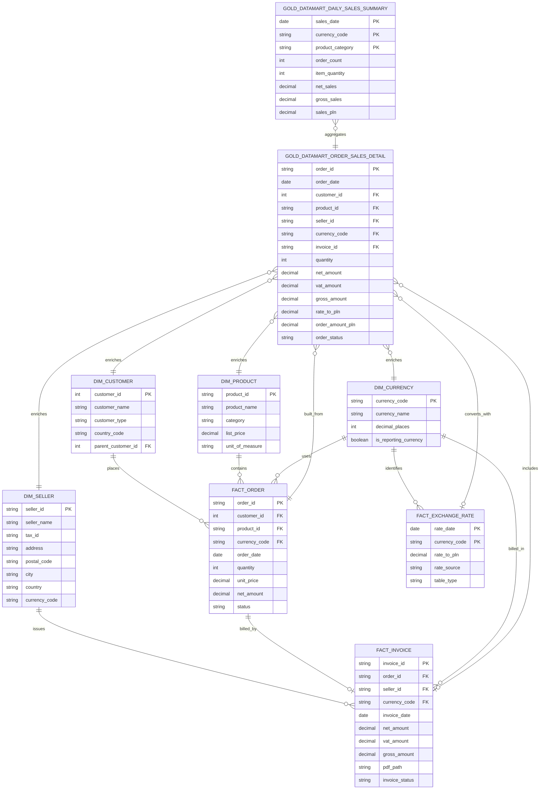

# Target Data Model

This is a shop's order-to-cash model. One table, one job. The file format (CSV, Excel, Parquet, ...) does not matter for this diagram — only the Gold layer meaning does.

See [INGESTION_PLAN.md](INGESTION_PLAN.md) for how each table is built (Bronze → Silver → Gold), and the [flows/](flows/) folder for step-by-step guides.

## Which file feeds which table

| Table | Purpose | Source file(s) | Flow |
|---|---|---|---|
| `dim_seller` | Legal seller that issues invoices | `sellers_delta/` | 02 |
| `dim_product` | Product catalog and list prices | `products_excel.xlsx` | 02 |
| `dim_customer` | Customer accounts (holding company → account → branch hierarchy via `parent_customer_id`) | `customers.csv` + `customers_dirty.csv` | 03 |
| `dim_currency` | Approved currency reference data | `currencies.csv` | 01 |
| `fact_order` | Sales transactions | `orders.parquet` + `orders_stream.parquet` + `orders_schema_change.parquet` | 05 |
| `silver_order_status_history` | Order status over time (not in the ER diagram above) | `order_status_changes.parquet` | 05 |
| `fact_exchange_rate` | Daily currency conversion rates | `exchange_rates_historical.csv` + NBP API | 01 |
| `fact_invoice` | Invoice documents and extracted fields | `invoices/*.pdf` | 04 |
| `gold_datamart_order_sales_detail` | One joined row per order | Built from the Gold tables above | 06 |
| `gold_datamart_daily_sales_summary` | Daily aggregated sales for the dashboard | Built from `gold_datamart_order_sales_detail` | 07 |

## Rules

1. Dimensions = things (customer, product, seller, currency). Facts = events (order, invoice, rate).
2. One business meaning → one table, even if the file format changes.
3. Bronze keeps `source_file` and `ingested_at` on every row.
4. Exchange rates are the only table that mixes a CSV history with a live API feed.

## How the two marts are built

| Mart | Built from | One row per |
|---|---|---|
| `gold_datamart_order_sales_detail` | `fact_order` + `dim_customer` + `dim_product` + `dim_currency` + `dim_seller` + `fact_invoice` + `fact_exchange_rate` | `order_id` |
| `gold_datamart_daily_sales_summary` | `gold_datamart_order_sales_detail`, grouped by `order_date` + `currency_code` + `product_category` | one row per day/currency/category |

See Flow 06 for the join diagram, and Flow 07 for the dashboard built on top of these marts.
