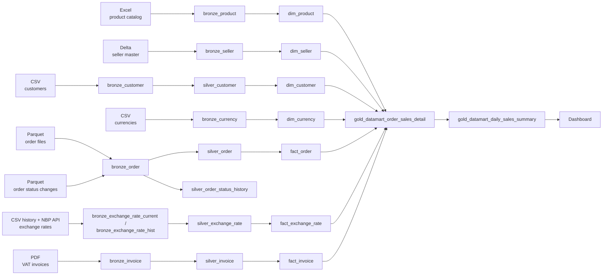
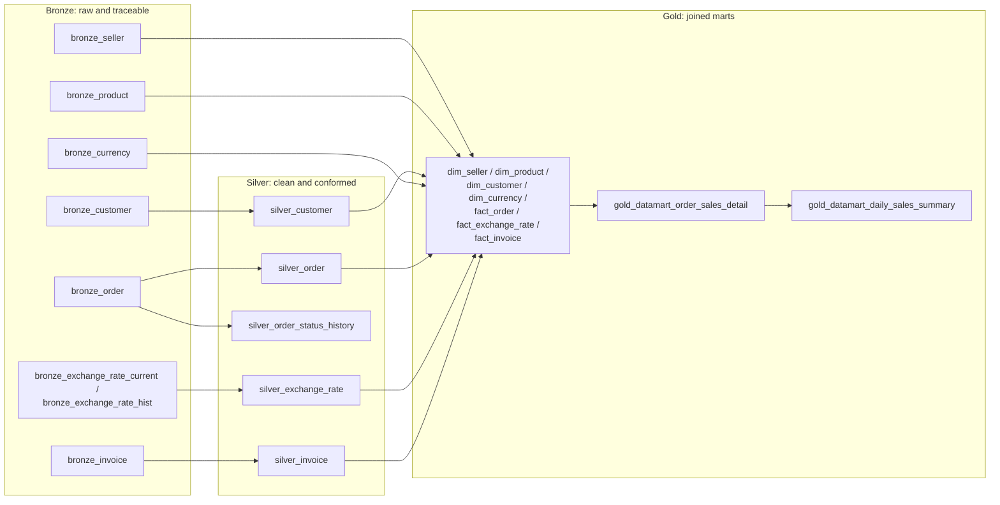
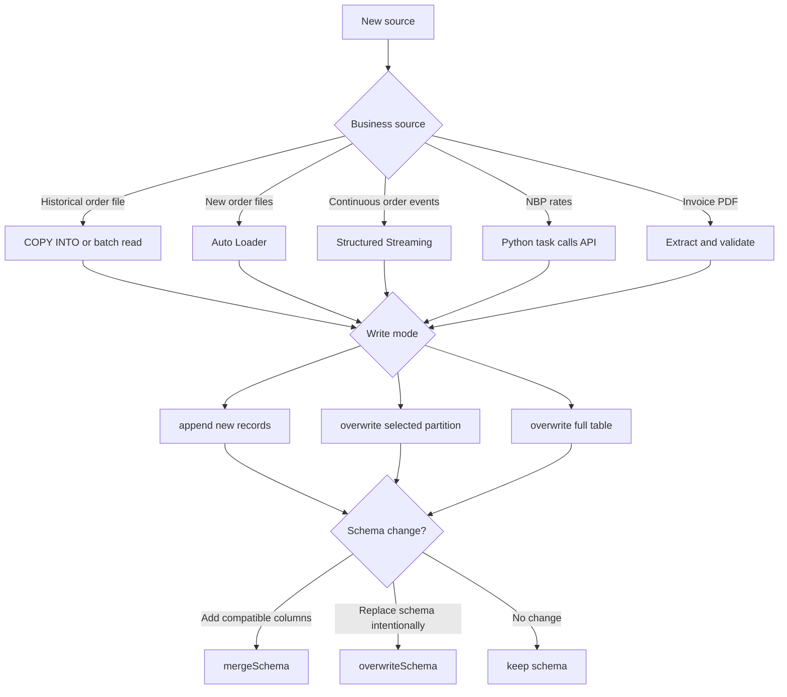

# Source-to-Target Ingestion Plan

One page map: which file goes where, and which flow builds it. Step-by-step details live in [flows/](flows/).

## Flow index

| Flow | Topic | Bronze | Silver | Gold |
|---|---|---|---|---|
| [01](flows/01_currency_exchange_rate.md) | Currency & exchange rate | `bronze_currency`, `bronze_exchange_rate_current`, view `bronze_exchange_rate_hist` | `silver_exchange_rate` | `dim_currency`, `fact_exchange_rate` |
| [02](flows/02_products_sellers.md) | Products & sellers | `bronze_product`, `bronze_seller` | — (published as-is) | `dim_product`, `dim_seller` |
| [03](flows/03_customers.md) | Customers | `bronze_customer` | `silver_customer` (recursive CTE: level/path/root) | `dim_customer` |
| [04](flows/04_invoices.md) | Invoices | `bronze_invoice` (VARIANT) | `silver_invoice` | `fact_invoice` |
| [05](flows/05_orders.md) | Orders | `bronze_order` | `silver_order` (SCD1), `silver_order_status_history` (SCD2) | `fact_order` |
| [06](flows/06_data_quality_cleaning_joining.md) | Data quality, cleaning, joining | — | applies to every Silver table above | `gold_datamart_order_sales_detail`, `gold_datamart_sales_by_currency`, `gold_datamart_daily_metrics` |
| [07](flows/07_dashboard.md) | Dashboard | — | — | `gold_datamart_daily_sales_summary` → dashboard |

## Source mapping

## Medallion architecture

Bronze stays close to the source and is replayable. Silver is clean, typed, and deduplicated. Gold is business-ready for reporting.

## Quality gates (Flow 06 covers this in depth, using DQX)

- Dimensions: unique keys, required names, valid tax IDs, valid product prices, approved currencies.
- Orders: unique order IDs, valid customer/product keys, positive quantity, non-negative amount.
- Exchange rates: unique `(effectiveDate, code)`, positive `mid`, supported currency.
- Invoices: unique invoice ID, valid order ID, matching seller/buyer, and `net + VAT = gross`.
- Every Bronze table: keep `source_file`, `ingested_at`, and quarantine status.

## Load decision

