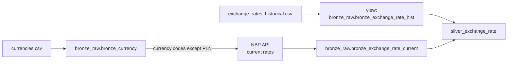

# Flow 01: Currency & Exchange Rate Pipeline (Bronze → Silver)

## Source-to-table map



## 0. Environment setup

- Create three schemas: `bronze_raw`, `silver`, `gold`.
- Create one volume for input files.

> implement all databricks resources in DAB's, below only SQL hint.

```sql
CREATE SCHEMA IF NOT EXISTS bronze_raw;
CREATE SCHEMA IF NOT EXISTS silver;
CREATE SCHEMA IF NOT EXISTS gold;

CREATE VOLUME workspace.bronze_raw.input_data;
```

*This is one proposal. Feel free to solve it differently.*

## 1. Bronze — `bronze_currency` (currency reference)

- Load `currencies.csv`.
- Cast each column to its real type. Don't leave everything as string.
- Write mode: full overwrite. It's a small, rarely-changing table.

*This is one proposal. Feel free to solve it differently.*

## 2. Bronze — historical exchange rates

- Point to the historical CSV file.
- Create a **view**, not a managed table.
- Give it explicit types. Don't rely on inferred schema.

*This is one proposal. Feel free to solve it differently.*

## 3. Bronze — current exchange rates from the API

- Read the currency list from `bronze_currency`.
- Call the NBP API for every currency except PLN.
- Match the shape of the historical table.
- Write mode: full overwrite. This table only holds the latest snapshot.

*This is one proposal. Feel free to solve it differently.*

## 4. Silver — combined exchange rate table

- Combine historical and current data.
- Write mode: replace only the changed date(s), not the whole table.

*This is one proposal. Feel free to solve it differently.*

## 5. Orchestration — two Databricks Jobs

The currency list and the rate build don't change on the same cadence, so split them:

- **Job A — `load_bronze_currency`.** Runs step 1. Trigger: manual — someone approves a currency change on purpose.
- **Job B — `build_silver_exchange_rate`.** Runs steps 2–4. Trigger: fires when `bronze_currency` changes.
- Use notebook/SQL tasks only.
- Check first if PySpark/Databricks already solves a step natively before adding an external package.

*This is one proposal. Feel free to solve it differently.*
