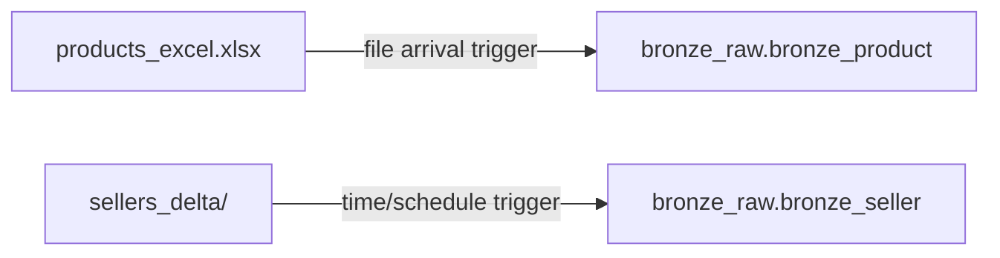

# Flow 05: Product & Seller Ingestion (Bronze only)

Two simple 1:1 loads: one file, one table. The interesting part is the **trigger**, since the sources arrive differently.

## Source-to-table map

## Job A — `load_bronze_product`

- Read `products_excel.xlsx` into `bronze_product`, as-is.
- Write mode: append — a new file is a new delivery.
- Trigger: file arrival. The catalog only changes when a new file lands.

*This is one proposal. Feel free to solve it differently.*

## Job B — `load_bronze_seller`

- Read `sellers_delta/` into `bronze_seller`.
- Write mode: append.
- Trigger: time-based schedule (e.g. nightly). There's no event to react to here.

Note: For practice purposes, you can create an external table on **this** Delta format files (other formats are also supported for external tables, but delta is native in databricks). This table is for learning and testing only and will not be used in the ETL process.

*This is one proposal. Feel free to solve it differently.*

## Job summary

| Job | Task | Source → Target | Trigger | Write mode |
|---|---|---|---|---|
| `load_bronze_product` | Notebook/SQL | `products_excel.xlsx` → `bronze_product` | File arrival | Append |
| `load_bronze_seller` | Notebook/SQL | `sellers_delta/` → `bronze_seller` | Time/schedule | Append |
