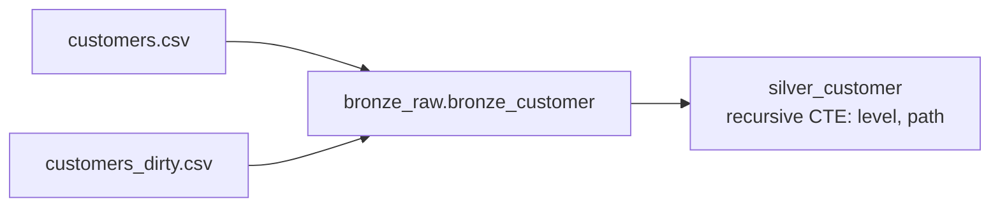

# Flow 03: Customer Ingestion (Bronze → Silver)

## Source-to-table map

## 1. Bronze — land both customer batches into one table

- `customers.csv` and `customers_dirty.csv` are two batches of the same source.
- Land both into one `bronze_customer` table.
- Write mode: append — each batch is a new delivery.

*This is one proposal. Feel free to solve it differently.*

## 2. The tricky part

- The two files use a different column order. Map by column name, not position.
- Some headers have spaces, some don't. Normalize them before/while writing to Bronze.
- Don't hardcode a fixed schema — read the header row of each file.

*This is one proposal. Feel free to solve it differently.*

## 3. What's already in the data (for later use)

- Every row has a `parent_customer_id`. It builds a hierarchy: holding company → account → branch.
- Leave it as-is in Bronze. It's the input for a recursive CTE in Silver.

*This is one proposal. Feel free to solve it differently.*

## 4. Silver — flatten the hierarchy with a recursive CTE

- Clean and rename columns. Cast IDs. Dedupe to one row per `customer_id`.
- Use a recursive CTE (`WITH RECURSIVE`) to compute, per customer:
  - `level` — 0 for a root, +1 per generation down.
  - `hierarchy_path` — the chain of names from root to this customer.
  - `root_customer_id` — the top holding company this customer belongs to.
- Join map: `silver_customer` to itself (self-join), on `customer_id = parent_customer_id`, to walk one level up/down the hierarchy.
- Write mode: overwrite table — one changed row can shift the level/path of everything below it.

*This is one proposal. Feel free to solve it differently.*
