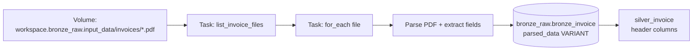
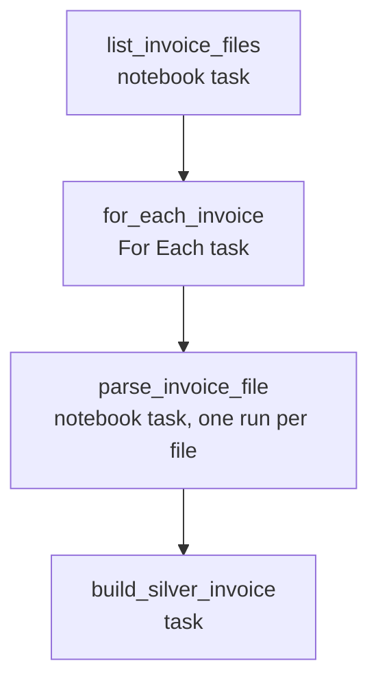

# Flow 02: Invoice Ingestion Pipeline (Bronze VARIANT → Silver tabular)

## Source-to-table map

## Job task graph

## 1. Task — list files in the volume

- List every PDF under the invoices folder.
- Prefer a native listing approach over a third-party package.
- Publish the file list as a task value for the next task.

*This is one proposal. Feel free to solve it differently.*

## 2. Task — `For Each` over the file list

- Add a **For Each** task using the list from step 1.
- Run one nested task per invoice file.
- Pick a sensible concurrency so parsing/API limits aren't hit.

*This is one proposal. Feel free to solve it differently.*

## 3. Nested task — parse one PDF into Bronze as VARIANT

- Read the PDF from the volume.
- Check for a native Databricks way to parse it before using an external library.
- Extract fields using the schema in [invoice_extraction_schema.json](../invoice_extraction_schema.json). Again, check for a native option first.
- Save one row per file, with the extracted content in a real `VARIANT` column.
- Write mode: append — only process files not yet ingested.

*This is one proposal. Feel free to solve it differently.*

## 4. Silver — explode the VARIANT into flat table

- Write mode: overwrite, partitioned by `invoice_id`.

*This is one proposal. Feel free to solve it differently.*

## 5. Job summary

| Task | Type | Purpose |
|---|---|---|
| `list_invoice_files` | Notebook | List PDFs, publish file list as task value |
| `for_each_invoice` | For Each | Fan out one run per file |
| `parse_invoice_file` | Notebook (nested) | Parse PDF, extract fields, append to Bronze VARIANT table |
| `build_silver_invoice` | Notebook or SQL | Explode Bronze into the invoice flat header table |

