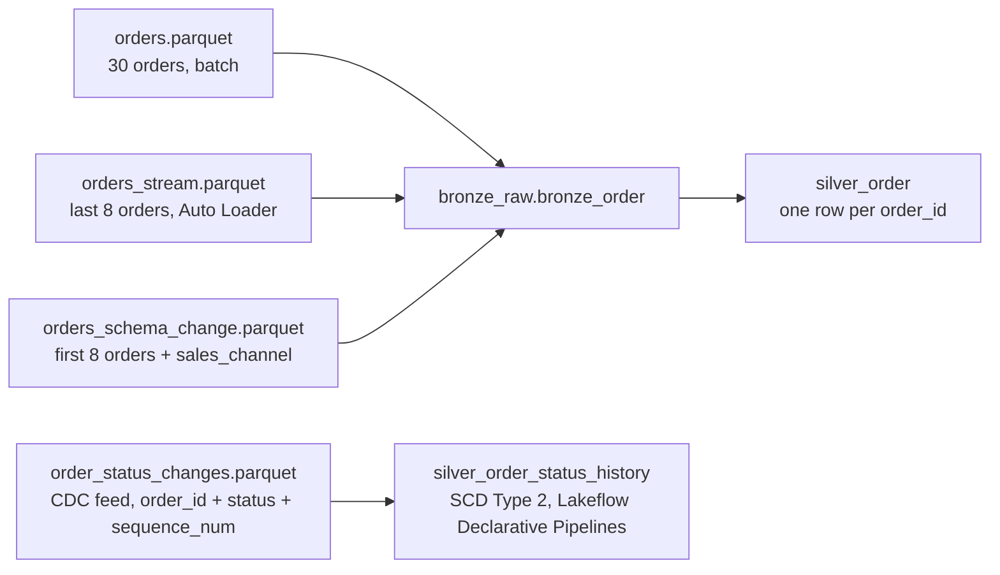

# Flow 04: Order Ingestion (Bronze → Silver) — batch, streaming, and schema evolution

## Source-to-table map

All three files are Parquet and all three feed the **same** `bronze_order` table — this flow is about the risk of treating "same format" as "same, safe-to-merge data".

## 1. Bronze — batch load of `orders.parquet`

- Load the full 30-order snapshot into `bronze_order`.
- Write mode: append — this is the initial historical load.

*This is one proposal. Feel free to solve it differently.*

## 2. Bronze — incremental load of `orders_stream.parquet` via Auto Loader

- Read this folder with Auto Loader or Structured Streaming, not a one-off batch read.
- Give it its own schema location and checkpoint.
- Write mode: append.

*This is one proposal. Feel free to solve it differently.*

## 3. Bronze — schema evolution via `orders_schema_change.parquet`

- This file adds a new column, `sales_channel`.
- Write mode: append, with schema evolution turned on explicitly.

*This is one proposal. Feel free to solve it differently.*

## 4. The risk: multiple Parquet files are not automatically new data

- `orders_schema_change.parquet` replays the same first 8 orders that are already in `orders.parquet`.
- `orders_stream.parquet` replays the same last 8 orders that are already in `orders.parquet`.
- Reading many Parquet files together does not merge schemas automatically — `mergeSchema` must be explicit, or a new column can silently disappear.
- Re-running a step appends the same rows again. Append alone is not idempotent.

*This is one proposal. Feel free to solve it differently.*

## 5. Silver — one row per `order_id`

- Dedupe on `order_id`, keep the latest record per key.
- Cast types, normalize `status`, validate keys and amounts.
- Write mode: merge/upsert on `order_id`.

*This is one proposal. Feel free to solve it differently.*

## 6. Order status history as SCD Type 2, via Lakeflow Declarative Pipelines

`order_status_changes.parquet` is a real change feed, not a duplicate. It has several rows per `order_id`, one per status change, each with a `sequence_num`.

- Build a Lakeflow Declarative Pipeline with an `AUTO CDC` flow into `silver_order_status_history`:
  - `KEYS (order_id)`, `SEQUENCE BY sequence_num`, `STORED AS SCD TYPE 2`.
  - `APPLY AS DELETE WHEN status = 'cancelled'`.
- `silver_order` answers "what is this order now". `silver_order_status_history` answers "what happened to it over time". Keep them separate.
- Join map (optional check): `silver_order` to `silver_order_status_history` on `order_id`, to compare the current status against its full history.

*This is one proposal. Feel free to solve it differently.*

## 7. Job summary

| Task | Type | Purpose |
|---|---|---|
| `load_orders_batch` | Notebook/SQL | Append `orders.parquet` into `bronze_order` |
| `load_orders_stream` | Notebook (Auto Loader/streaming) | Incrementally append `orders_stream.parquet` into `bronze_order` |
| `load_orders_schema_change` | Notebook/SQL | Append `orders_schema_change.parquet` with `mergeSchema` into `bronze_order` |
| `build_silver_order` | Notebook or SQL | Deduplicate on `order_id`, merge/upsert into `silver_order` |
| `build_silver_order_status_history` | Lakeflow Declarative Pipeline (`AUTO CDC`) | Apply `order_status_changes.parquet` as SCD Type 2 into `silver_order_status_history` |
