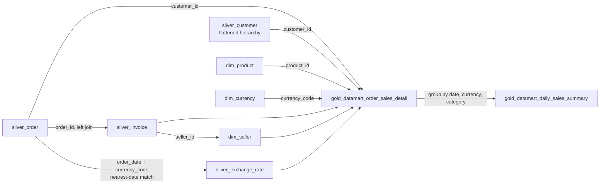

# Flow 06: Data Quality, Cleaning & Joining — Requirements

Applies across every Silver/Gold table from flows 01–05. One proposal per point — you may solve it differently.

## 1. Cleaning

- Normalize headers and cast every Bronze string column to its real type.
- One dedup pass per table (not per source file). Define what "latest" means.
- A column delivered later (e.g. `sales_channel`, flow 05) must land as nullable in Silver, with old rows defaulting to `NULL` — never break the load or drop the column.
- Quarantine or drop invalid rows; log why.
- Flatten the customer hierarchy once, in Silver (flow 03) — don't redo it in Gold.

## 2. DQX

- Use Databricks Labs DQX, not ad-hoc `filter`/`when` logic.
- Define completeness, uniqueness, validity, and referential-integrity rules per table.
- Mark each rule as warning or error; quarantine on error.
- Run DQX at the Bronze→Silver boundary.
- One shared quarantine table for all sources.

## 3. Joining

| Left table | Right table | Join column(s) | Join type |
|---|---|---|---|
| `fact_order` | `dim_customer` | `customer_id` | left |
| `fact_order` | `dim_product` | `product_id` | left |
| `fact_order` | `dim_currency` | `currency_code` | left |
| `fact_order` | `fact_invoice` | `order_id` | left |
| `fact_invoice` | `dim_seller` | `seller_id` | left |
| `fact_order` | `fact_exchange_rate` | `currency_code` + nearest `order_date` | left |

- Confirm cardinality per join; re-check the grain stays one row per `order_id` after all joins.
- Use left joins wherever a missing invoice/rate must not drop the order.
- Resolve the exchange-rate join to the nearest date, not an equal-date match.
- The exchange-rate join must produce a delivered column: `order_amount_pln = net_amount * rate_to_pln` on `gold_datamart_order_sales_detail`. A joined rate that's never converted into an actual PLN column doesn't meet this requirement.

## 4. Reporting sink tables

Every transformation must land in a named Gold table — no ad-hoc/temp-only queries (see EXERCISE.md Requirements).

| Sink table | Built with | Grain |
|---|---|---|
| `gold_datamart_sales_by_currency` | `group by` (`order_date`) + `pivot` (`currency_code` → one column per currency) + `withColumn` (add a `total` column across currencies) | One row per `order_date` |
| `gold_datamart_daily_metrics` | `unpivot` of `gold_datamart_daily_sales_summary`'s 5 measures into `metric_name`/`metric_value` | One row per `sales_date` + `currency_code` + `product_category` + `metric_name` |

- Add at least one literal-value column with `lit()` to a sink table (e.g. a constant `source_system` or `currency_base = 'PLN'` marker) — a value that isn't derived from any source column.
- Use `distinct` only to validate inputs (e.g. `currency_code` values match `dim_currency`) — not as a table of its own.
- Check: `SUM(metric_value) WHERE metric_name = 'net_sales'` in `gold_datamart_daily_metrics` matches `SUM(net_sales)` in `gold_datamart_daily_sales_summary`.

