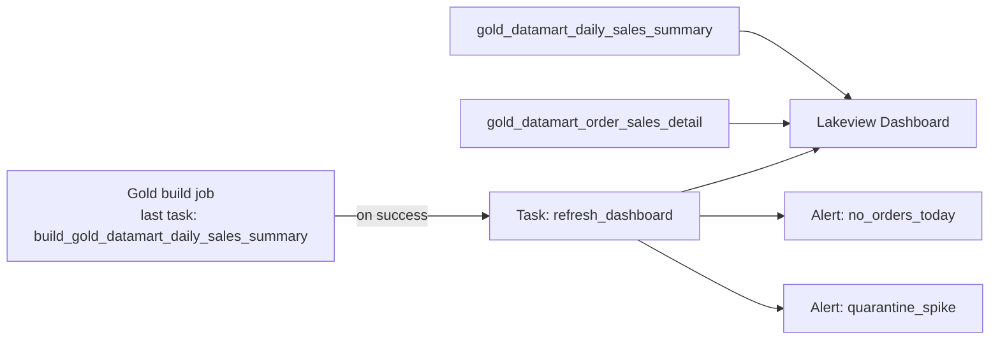

# Flow 07: Reporting Dashboard + Scheduled Refresh

## Source-to-table map

## 1. Build the dashboard

- Create a Lakeview dashboard on the Gold marts only — never query Silver/Bronze directly.
- Cover at least: sales trend by date, sales by currency, sales by category, order status mix.
- Parameterize by date range and currency instead of hardcoding filters.

*This is one proposal. Feel free to solve it differently.*

## 2. Add the dashboard refresh as a job task

- Add a **Dashboard** task as the last task in the Gold job, not an ad-hoc notebook.
- Run it only on success of `build_gold_datamart_daily_sales_summary`.
- Don't give the dashboard its own schedule — let the Gold job drive the refresh.

*This is one proposal. Feel free to solve it differently.*

## 3. Add alerts

- Create a SQL Alert on `gold_datamart_daily_sales_summary`: trigger when today's `order_count` is 0 — catches a day where nothing loaded (freshness/completeness check), not a business anomaly.
- Create a second SQL Alert on the DQX quarantine table (flow 06): trigger when the quarantined row count for today goes above a threshold.
- Add both as **Alert** tasks in the job, after `refresh_dashboard` — they should evaluate against the data that was just refreshed, not stale data.
- Set a real notification destination (email or chat channel) for each alert. An alert nobody receives is the same as no alert.

*This is one proposal. Feel free to solve it differently.*

## Job summary

| Task | Type | Purpose | Depends on |
|---|---|---|---|
| `build_gold_datamart_order_sales_detail` | Notebook or SQL | Build `gold_datamart_order_sales_detail` | Silver tables |
| `build_gold_datamart_daily_sales_summary` | Notebook or SQL | Build `gold_datamart_daily_sales_summary` | `build_gold_datamart_order_sales_detail` |
| `refresh_dashboard` | Dashboard (Refresh Dashboard task) | Refresh the Lakeview dashboard | `build_gold_datamart_daily_sales_summary` (on success) |
| `alert_no_orders_today` | Alert | Notify if today's `order_count` is 0 | `refresh_dashboard` |
| `alert_quarantine_spike` | Alert | Notify if today's quarantined row count exceeds threshold | `refresh_dashboard` |
