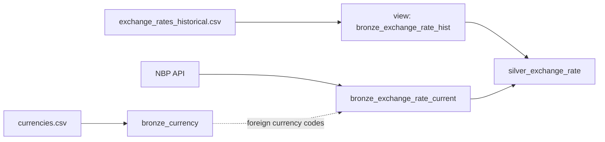

# Flow 01 — Currency & Exchange Rate

Builds the currency reference data and a daily exchange-rate table that combines a historical CSV with current rates from the NBP (Narodowy Bank Polski) API.

Requirements: [flows/flows/01_currency_exchange_rate.md](../../flows/flows/01_currency_exchange_rate.md), plus the general rules in [docs/EXERCISE.md](../../docs/EXERCISE.md), [docs/DATA_MODEL.md](../../docs/DATA_MODEL.md) and [docs/INGESTION_PLAN.md](../../docs/INGESTION_PLAN.md).

## What gets built

| Layer | Object | Type | Source | Write mode | Notebook |
|---|---|---|---|---|---|
| Bronze | `bronze_currency` | table | `currencies.csv` | full overwrite | `01_load_bronze_currency.py` |
| Bronze | `bronze_exchange_rate_hist` | **view** | `exchange_rates_historical.csv` | n/a (view) | `02_create_bronze_exchange_rate_hist.py` |
| Bronze | `bronze_exchange_rate_current` | table | NBP API | full overwrite | `03_load_bronze_exchange_rate_current.py` |
| Silver | `silver_exchange_rate` | table | the two exchange-rate Bronze objects | replace changed dates only | `04_build_silver_exchange_rate.py` |

All objects live in the catalog chosen by the bundle target (`poc_dev`, `poc_test`, `poc`). Bronze objects are in schema `bronze_raw`, Silver in `silver`. In the `dev` target, development mode prefixes schema names with `dev_<user>_`.

Solid arrows are data lineage, the dashed arrow is a parameter dependency: `bronze_currency` decides which currencies are called, but none of its columns reach Silver.



## Jobs and triggers

Defined in [resources/flow01_currency_job.job.yml](../../resources/flow01_currency_job.job.yml) and [resources/flow01_exchange_rate_job.job.yml](../../resources/flow01_exchange_rate_job.job.yml). Both use notebook tasks only, on serverless environment version 6.

| Job | Runs | Trigger |
|---|---|---|
| `load_bronze_currency` | step 1 | manual — someone approves a currency change |
| `build_silver_exchange_rate` | steps 2–4 | table update on `bronze_currency` |

Inside `build_silver_exchange_rate`, steps 2 and 3 run in parallel (step 3 only needs `bronze_currency`, not the view). Step 4 waits for both.

The catalog, schema and volume names are job-level parameters, filled in by the bundle, and read by every notebook through widgets.

## Approach per step

### Step 1 — `bronze_currency`

- Batch read (`spark.read`) of `currencies.csv` with an explicit schema: `decimal_places` as INT, `is_reporting_currency` as BOOLEAN.
- Adds `source_file` and `ingested_at`.
- Full overwrite on every run. The table is small and changes rarely.
- Batch, not Auto Loader: the job is started manually and should always rebuild the table from the file, also when a corrected file is uploaded under the same name.

### Step 2 — `bronze_exchange_rate_hist` (view)

- `CREATE OR REPLACE VIEW` over `read_files(...)` with an explicit schema. No schema inference.
- Column names and format stay as in the source, which matches the NBP API (`table`, `currency`, `code`, `no`, `effectiveDate`, `mid`).
- `mid` is `DECIMAL(18,6)`, not DOUBLE, because rates are used in money calculations.
- A view has no load moment, so `ingested_at` is the file's modification time. `source_file` is the file name.

### Step 3 — `bronze_exchange_rate_current`

- Reads the currency codes from `bronze_currency`, taking the ones marked `is_reporting_currency = false` (so PLN is left out in the current file).
- Calls the NBP API once per currency with the Databricks `http_request()` SQL function, through a Unity Catalog HTTP connection `nbp_api`. The notebook creates the connection if it does not exist.
- Endpoint: current mid rate from table A, `https://api.nbp.pl/api/exchangerates/rates/A/{code}/?format=json`.
- The JSON is parsed with an explicit schema into exactly the same columns and types as the historical view, so Silver can combine both directly.
- A non-200 response stops the task.
- `source_file` is the API URL, `ingested_at` is the load time.
- Full overwrite: the table only holds the latest snapshot.

### Step 4 — `silver_exchange_rate`

- Combines the view and the API table with `UNION ALL`. All Bronze columns are kept.
- No cleaning: the source data has no empty values, extra spaces, invalid rates or duplicate rows.
- Deduplication with `QUALIFY`: one row per `effectiveDate` + `code`.
- Changed dates are found by comparing the deduplicated data with Silver (`EXCEPT` on the source columns). Tracking columns are not compared, so a new API load time alone does not count as a change.
- Only the changed dates are rewritten, with `INSERT INTO ... REPLACE USING (effectiveDate)`. The first run creates the table and loads everything.

## Design decisions not specified in the requirements

| Topic | Decision | Reason |
|---|---|---|
| NBP endpoint | Per-currency current rate, table A | The flow says "call the NBP API" without an address. Table A holds mid rates, matching the historical file. |
| API call | `http_request()` + UC HTTP connection | Flow step 5: prefer a native Databricks solution over an external package. |
| Rate type | `DECIMAL(18,6)` | Exact arithmetic for money; NBP returns up to 4 decimals for these currencies. |
| Which currencies to call | `is_reporting_currency = false`, not a literal `'PLN'` | The flow says "every currency except PLN". The flag in `currencies.csv` marks exactly that row, so the rule is read from the data instead of being hardcoded, and a change of reporting currency needs no code change. NBP publishes foreign rates against PLN, so there is no endpoint for the reporting currency itself. The condition is stated directly rather than defaulting a missing flag, so only currencies the file explicitly marks `false` are called. |
| `ingested_at` in the view | File modification time | A view has no load moment of its own. |
| Which row wins on a duplicate | **NBP API first**, then latest `ingested_at` | Flow 06 asks to "define what latest means". The API is the bank's own published source; the CSV is a copy. |
| Silver column names | Same as Bronze | No renaming required by the flow; renaming to the data model names can happen in Gold. |
| File location | `/Volumes/<catalog>/bronze_raw/input_data/data/` | All source files are uploaded to one `data` folder; notebooks point at exact file names. |

## Deploy and run

```bash
databricks bundle deploy -t dev
databricks bundle run load_bronze_currency -t dev
```

`load_bronze_currency` writes `bronze_currency`, and the table update trigger then starts `build_silver_exchange_rate` in every target. Table update triggers are checked periodically, so the run can start shortly after the first job finishes rather than immediately.

Development mode normally pauses all job triggers. The trigger in [flow01_exchange_rate_job.job.yml](../../resources/flow01_exchange_rate_job.job.yml) sets `pause_status: UNPAUSED` explicitly, so it stays active in dev too. (A target-level preset `trigger_pause_status: UNPAUSED` is rejected by the CLI in development mode.) To run the second job without waiting for the trigger:

```bash
databricks bundle run build_silver_exchange_rate -t dev
```

**First deploy to a new catalog (test, prod):** Databricks checks that the trigger table exists when it creates `build_silver_exchange_rate`. On an empty catalog, run the steps in this order:

1. `databricks bundle deploy -t test` (creates the schemas, volume and the first job; the second job fails)
2. Upload `currencies.csv` and `exchange_rates_historical.csv` to the volume's `data/` folder
3. `databricks bundle run load_bronze_currency -t test`
4. `databricks bundle deploy -t test` (now creates the second job)

