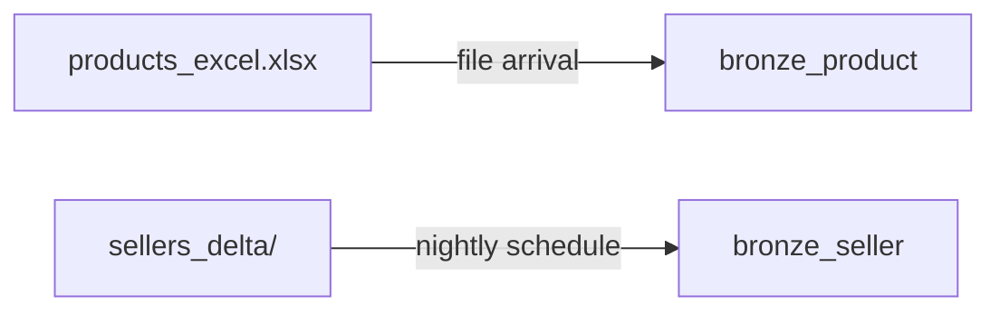

# Flow 02 — Products & Sellers

Two independent Bronze loads, one file to one table. Neither entity has a Silver step: [docs/INGESTION_PLAN.md](../../docs/INGESTION_PLAN.md) publishes both straight to `dim_product` / `dim_seller` in Gold.

Requirements: [flows/flows/02_products_sellers.md](../../flows/flows/02_products_sellers.md), plus the general rules in [docs/EXERCISE.md](../../docs/EXERCISE.md), [docs/DATA_MODEL.md](../../docs/DATA_MODEL.md) and [docs/INGESTION_PLAN.md](../../docs/INGESTION_PLAN.md).

## What gets built

| Layer | Object | Type | Source | Write mode | Notebook |
|---|---|---|---|---|---|
| Bronze | `bronze_product` | table | `products_excel.xlsx` | append | `01_load_bronze_product.py` |
| Bronze | `bronze_seller` | table | `sellers_delta/` | append | `02_load_bronze_seller.py` |

Both tables are managed and live in schema `bronze_raw` of the catalog chosen by the bundle target (`poc_dev`, `poc_test`, `poc`). In the `dev` target, development mode prefixes schema names with `dev_<user>_`.



The two loads share nothing. The flow's own point is the **triggers**, since the sources arrive differently.

## Jobs and triggers

Defined in [resources/flow02_product_job.job.yml](../../resources/flow02_product_job.job.yml) and [resources/flow02_seller_job.job.yml](../../resources/flow02_seller_job.job.yml). Both use notebook tasks only, on serverless environment version 6.

| Job | Trigger | Why |
|---|---|---|
| `load_bronze_product` | file arrival on `data/products_excel/` | The catalog only changes when a new file lands, so react to the event |
| `load_bronze_seller` | schedule, nightly 02:00 UTC | Nothing pushes to the Delta folder, so poll instead |

Development mode normally pauses triggers and schedules. Both job files set `pause_status: UNPAUSED` explicitly so the triggers stay active in dev too.

## Approach per job

### Job A — `bronze_product`

- **Auto Loader** over the products folder with the **native Excel reader**: `cloudFiles.format = "excel"`. No external package — the reader is built into the runtime (Databricks Runtime 17.1+).
- `pathGlobFilter = "*.xlsx"` restricts the stream to workbooks. This is the only place extension filtering can happen: a file arrival trigger path cannot contain a wildcard and the trigger has no filter option of its own.
- `headerRows = 1` — the sheet has one header row, which is also the maximum the reader supports.
- Explicit all-`STRING` schema, no inference. Nothing is cast: `unit_price` becomes a decimal and is renamed to `list_price` further downstream.
- Adds `source_file` from `_metadata.file_name` and `ingested_at`.
- `trigger(availableNow=True)` processes whatever is waiting and stops, so the task finishes rather than running as a continuous stream.
- Append, with Auto Loader's checkpoint deciding what is new. This is what makes "a new file is a new delivery" work: the trigger does not say which file arrived, so the checkpoint is what distinguishes a new delivery from one already ingested. Deliveries can have any file name, several can be waiting at once, and a run that fires without a new file processes nothing.

### Job B — `bronze_seller`

- `spark.read.format("delta")` over the folder. The Delta schema is the Bronze schema; nothing is cast.
- Adds `source_file` (the folder name) and `ingested_at`.
- Append. Re-runs accumulate rows; deduplication happens downstream, not in Bronze.

## Design decisions not specified in the requirements

| Topic | Decision | Reason |
|---|---|---|
| Excel reader | Native `cloudFiles.format = "excel"` | Built into the runtime, so no external package — flow step 5 asks to check first whether Databricks solves a step natively. `spark-excel` was ruled out anyway: serverless supports neither Maven coordinates, JAR libraries in notebooks, nor third-party Spark data sources, and Free Edition has no classic compute to fall back to. |
| Incremental loading | Auto Loader, not a plain read | The file arrival trigger does not pass the arriving file name to the job and its path cannot contain a wildcard, so the job has to work out for itself what is new. Auto Loader's checkpoint does that, which is what makes "a new file is a new delivery" hold for arbitrary file names. A plain read of the folder would re-ingest every past delivery on each run. |
| `.xlsx` filtering | `pathGlobFilter` on the reader | The trigger has no extension filter, so the only available filtering is reader-side. |
| Product column types | All `STRING`, nothing cast | The flow says read the file as-is. The sheet's `unit_price` has to become a decimal and `unit_price` → `list_price` has to be renamed for `DIM_PRODUCT`; both happen downstream. |
| Checkpoint location | `_checkpoints/bronze_product_excel` in the volume, outside `data/` | Writing the checkpoint must not look like a new arrival to the trigger watching `data/products_excel/`. The `_excel` suffix names the source format, so the folder is identifiable once other flows add checkpoints of their own. |
| `unit_of_measure` | Not populated | `DIM_PRODUCT` has the column but the sheet has no source for it. |
| Seller read format | Delta, not Parquet | The folder has a transaction log and is at version 1: an overwrite tombstoned the version 0 part file, which is still on disk. The Delta reader returns 1 row; a Parquet read of the same folder returns 2. |
| Seller table type | Managed | Unity Catalog does not allow an external table here: "You can't define a table on any data files or directories within a volume." A real external table needs an external location over cloud storage, which Free Edition does not have. The practice external table in the flow doc is therefore not possible; `SELECT * FROM delta.'<path>'` reads the files in place instead. |
| `source_file` for sellers | The folder name, `sellers_delta` | Part file names are an internal Delta detail and change on every overwrite. |
| Product file location | `data/products_excel/`, its own folder | A file arrival trigger cannot filter by extension and its path cannot hold a wildcard, so a folder is the only way to scope it. Watching the shared `data/` folder instead would start this job on every unrelated upload — harmless, since Auto Loader would find no new workbook and write nothing, but it would fill the run history with no-op runs and spend compute on a quota-limited workspace. Every product delivery is therefore expected to land in this folder. |
| Quarantine column | Not added | [docs/INGESTION_PLAN.md](../../docs/INGESTION_PLAN.md) lists quarantine status for Bronze tables, but data quality is flow 06. |

## Deploy and run

Product workbooks go in `data/products_excel/`, which is also what the trigger watches. Any `.xlsx` file name works — Auto Loader tracks which ones it has already read:

```
/Volumes/<catalog>/bronze_raw/input_data/data/products_excel/products_excel.xlsx
/Volumes/<catalog>/bronze_raw/input_data/data/sellers_delta/
/Volumes/<catalog>/bronze_raw/input_data/_checkpoints/bronze_product_excel   (created by the job)
```

```bash
databricks bundle deploy -t dev
databricks bundle run load_bronze_product -t dev
databricks bundle run load_bronze_seller -t dev
```

Uploading a workbook to `data/products_excel/` starts `load_bronze_product` on its own. File arrival triggers are checked periodically, so the run starts shortly after the upload rather than immediately. Uploads to the rest of `data/` do not start it.

To re-ingest a delivery that was already processed, delete the checkpoint folder — Auto Loader will not read the same file twice otherwise.

## Excel reader limitations

From the native reader's documentation, worth knowing before a new file is delivered:

- one header row only
- merged cells populate the top-left cell and NULL the rest
- password-protected files and `.xlsm` macros are not supported
- schema evolution is not supported with Auto Loader streaming, which is why the schema is explicit and `cloudFiles.schemaEvolutionMode` is `none`

The current sheet is a clean single-header grid, so none of these apply to it today.
