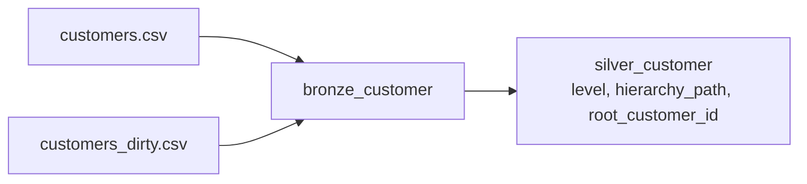

# Flow 03 — Customers

Lands the customer batches into one Bronze table, then flattens the customer hierarchy into Silver.

Requirements: [flows/flows/03_customers.md](../../flows/flows/03_customers.md), plus the general rules in [docs/EXERCISE.md](../../docs/EXERCISE.md), [docs/DATA_MODEL.md](../../docs/DATA_MODEL.md) and [docs/INGESTION_PLAN.md](../../docs/INGESTION_PLAN.md).

## What gets built

| Layer | Object | Type | Source | Write mode | Notebook |
|---|---|---|---|---|---|
| Bronze | `bronze_customer` | table | `data/customer_data/*.csv` | append + `mergeSchema` | `01_load_bronze_customer.py` |
| Silver | `silver_customer` | table | `bronze_customer` | overwrite | `02_build_silver_customer.py` |

Bronze objects live in schema `bronze_raw` and Silver in `silver`, in the catalog chosen by the bundle target (`poc_dev`, `poc_test`, `poc`). In the `dev` target, development mode prefixes schema names with `dev_<user>_`.



## The two batches

They are the same source delivered twice, with different headers and different column order:

| `customers.csv` | `customers_dirty.csv` | normalised to |
|---|---|---|
| `customer_name` | `customer name` | `customer_name` |
| `parent_customer_id` | `parent customer id` | `parent_customer_id` |
| `customer_id` | `customer id` | `customer_id` |
| `country` | `country code` | `country` / `country_code` |

Three of the four differences are whitespace. `country` versus `country code` is a real rename, so normalising whitespace does not reconcile them — `country code` becomes `country_code`, which is a different column from `country`. Both therefore exist in `bronze_customer`, each NULL on the rows of the batch that did not supply it. They are reconciled in Silver, where [flows/flows/03_customers.md:37](../../flows/flows/03_customers.md#L37) puts renaming.

`country_code` is the name [docs/DATA_MODEL.md](../../docs/DATA_MODEL.md) uses for `DIM_CUSTOMER`, so the "dirty" file is closer to the target model than the clean one.

Note also that `customers_dirty.csv` holds three rows — customers 111, 112 and 113 — whose values are identical to the same three rows in `customers.csv`. It is a replay, not an update. The duplicates are resolved by the dedupe on `customer_id` in Silver.

## Job and trigger

Defined in [resources/flow03_customer_job.job.yml](../../resources/flow03_customer_job.job.yml), a notebook task on serverless environment version 6.

| Job | Tasks | Trigger |
|---|---|---|
| `load_bronze_customer` | `load_bronze_customer` → `build_silver_customer` | file arrival on `data/customer_data/` |

Both steps are tasks of one job: an upload is a single event, and Silver has to be rebuilt whenever Bronze changes. `build_silver_customer` depends on `load_bronze_customer`, so a batch that failed to load does not quietly disappear from Silver — the second task never runs.

Development mode normally pauses triggers. The job file sets `pause_status: UNPAUSED` explicitly so the trigger stays active in dev too.

## Approach — Bronze

- One read per file. The notebook lists every `.csv` in `data/customer_data/` and reads each on its own.
- Only batches whose file name is not already among the table's `source_file` values are loaded, so an upload does not re-append earlier deliveries. On the first run the table does not exist and everything loads.
- `header=true` and no `inferSchema`, so column names come from each file's own header row and every column lands as `STRING`.
- Header names are normalised to lower snake_case; values are not touched.
- Adds `source_file` and `ingested_at`.
- Append with `mergeSchema`, so a batch bringing a column the table does not have extends the table rather than failing.
- Each batch loads inside its own `try`. A batch that fails does not hold up the others, and the task then fails naming every batch that did not load. A failed batch is never written, so its name never reaches `source_file` and the next run retries it.

## Approach — Silver

- Cleans and renames to the data model: values trimmed, `customer_id` and `parent_customer_id` cast to `INT`, country upper-cased.
- `country` and `country_code` are reconciled into one `country_code`. The expression is built from the columns actually present in Bronze, because `mergeSchema` means the Bronze column set depends on which batches have arrived.
- Dedupes to one row per `customer_id` with `QUALIFY`, newest `ingested_at` first.
- A recursive CTE walks one generation per step, producing `level`, `hierarchy_path` and `root_customer_id`. It is anchored on the customers that start a tree: those with no parent, plus any whose parent is not in the data, so no row is dropped.

Orphaned customers — a `parent_customer_id` pointing at an id that is not present — are findable without an extra column:

```sql
SELECT * FROM silver_customer
WHERE level = 0 AND parent_customer_id IS NOT NULL
```
- The schema is declared with `CREATE TABLE IF NOT EXISTS`, then filled with `INSERT OVERWRITE` — every row is replaced, since one changed row shifts the level and path of everything below it.

The current data gives three levels — holding company, account, branch:

| `customer_id` | `level` | `root_customer_id` | `hierarchy_path` |
|---|---|---|---|
| 201 | 0 | 201 | Northwind Holding |
| 101 | 1 | 201 | Northwind Holding > Ava Stone |
| 111 | 2 | 201 | Northwind Holding > Ava Stone > Ava Stone - Warsaw Branch |

## Design decisions not specified in the requirements

| Topic | Decision | Reason |
|---|---|---|
| One read per file | Required, not a preference | A single `csv()` read over both files would take the first file's header as the schema and map the second by position. With the column orders differing, country values would load into the name column. |
| Header normalisation | Lower snake_case, formatting only | Delta column names cannot contain spaces, so `customer id` cannot be written as-is. Only the formatting is changed; mapping `country code` to `country` would be a semantic rename, which the flow puts in Silver. |
| Column types | All `STRING` | The flow says to cast IDs in Silver, so Bronze does not cast. It also means `mergeSchema` can never hit a type conflict between batches — it only ever adds columns. |
| Header validation | None | [flows/flows/03_customers.md:24](../../flows/flows/03_customers.md#L24) says not to hardcode a schema. A batch whose id column is named differently still lands, as a new column, and can be mapped in Silver; failing the load would leave the delivery outside the lakehouse until code changed. A key-presence check belongs in flow 06. |
| `saveAsTable`, not `insertInto` | Name-based column resolution | `insertInto` resolves by position, which would misalign batches with different column order. |
| Trigger | File arrival on `data/customer_data/` | Flow 03 does not specify a trigger, and "each batch is a new delivery" is an upload event. A trigger path cannot be filtered, so the batches sit in a folder of their own; pointing it at the shared `data/` folder would start the job on every unrelated upload. |
| File selection | Every `.csv` in the folder | "Each batch is a new delivery", so no file name is hardcoded. The folder holds customer batches only, so requiring a `customers` prefix would reject a batch named differently. |
| Incremental loading | Skip file names already in `source_file` | Without it, a triggered run would re-append every batch in the folder, so each new delivery would multiply what is already in the table. Comparing against the target needs no checkpoint and makes a re-run after a failure load only what is outstanding. |
| Re-delivery under the same name | Not re-ingested | Batches are tracked by file name, so a corrected file uploaded under a name already loaded is skipped. A corrected batch therefore needs a new file name. |
| `customer_type` | Not populated | `DIM_CUSTOMER` has the column but neither file has a source for it. |
| `country` / `country_code` | `coalesce` into `country_code` in Silver | `country_code` is the name `DIM_CUSTOMER` uses. The expression is assembled from the columns Bronze actually has, so Silver still builds when only one batch has been delivered. |
| "Latest" for the dedupe | Newest `ingested_at`, then `source_file` | The newest batch to carry a customer wins. `source_file` breaks ties so the result is deterministic when two batches land in the same run and share a timestamp. |
| Silver schema | Declared, not derived | `silver_customer` is consumed by Gold and the dashboard, so the shape is pinned in DDL. A query that stopped producing these types fails the insert instead of silently changing the table, and `customer_id NOT NULL` turns the "every batch has an id" assumption into something enforced. |
| `hierarchy_path` separator | `' > '` | The flow asks for "the chain of names from root to this customer" without naming a separator. |
| Orphaned customers | Start a tree of their own | A recursive CTE anchored only on parentless customers would never reach a customer whose `parent_customer_id` points at a customer that is not in the data, silently losing it and everything below it. The anchor also admits those rows, so nothing is lost. They stay identifiable without an extra column: `level = 0` together with a non-null `parent_customer_id` means the parent was missing. Quarantining them belongs to flow 06. |
| `NOT EXISTS` for the orphan test | NULL-safe | `parent_customer_id NOT IN (SELECT customer_id FROM deduped)` evaluates to NULL for every row if any `customer_id` in `deduped` is NULL, which would silently restore the dropping behaviour. |
| Hierarchy cycles | Left to Spark's recursion limit | A cycle in `parent_customer_id` would recurse without end; the recursion level limit stops it and fails the task rather than hanging. |

## Deploy and run

Customer batches go in their own folder, which is also what the trigger watches:

```
/Volumes/<catalog>/bronze_raw/input_data/data/customer_data/customers.csv
/Volumes/<catalog>/bronze_raw/input_data/data/customer_data/customers_dirty.csv
```

```bash
databricks bundle deploy -t dev
databricks bundle run load_bronze_customer -t dev
```

The run executes both tasks: Bronze first, then the Silver rebuild.

Uploading a batch to `data/customer_data/` starts the job on its own. File arrival triggers are checked periodically, so the run starts shortly after the upload rather than immediately.

To re-ingest a batch that was already loaded, either give the file a new name or delete its rows from `bronze_customer`.