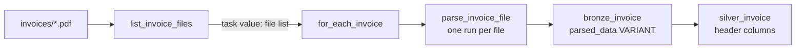

# Flow 04 — Invoices

Parses invoice PDFs into a Bronze `VARIANT` table, then flattens the headers into Silver.

Requirements: [flows/flows/04_invoices.md](../../flows/flows/04_invoices.md), plus the general rules in [docs/EXERCISE.md](../../docs/EXERCISE.md), [docs/DATA_MODEL.md](../../docs/DATA_MODEL.md) and [docs/INGESTION_PLAN.md](../../docs/INGESTION_PLAN.md).

## What gets built

| Layer | Object | Type | Source | Write mode | Notebook |
|---|---|---|---|---|---|
| Bronze | `bronze_invoice` | table | `data/invoices/*.pdf` | append | `01_list_invoice_files.py`, `02_parse_invoice_file.py` |
| Silver | `silver_invoice` | table | `bronze_invoice` | `INSERT OVERWRITE` | `03_build_silver_invoice.py` |

Bronze objects live in schema `bronze_raw` and Silver in `silver`, in the catalog chosen by the bundle target (`poc_dev`, `poc_test`, `poc`). In the `dev` target, development mode prefixes schema names with `dev_<user>_`.



## Job and triggers

Defined in [resources/flow04_invoice_job.job.yml](../../resources/flow04_invoice_job.job.yml). Notebook tasks only, on serverless environment version 6.

| Task | Type | Purpose |
|---|---|---|
| `list_invoice_files` | Notebook | Publishes the PDFs still to parse as a task value |
| `for_each_invoice` | For Each | One parse run per file, concurrency 4 |
| `build_silver_invoice` | Notebook | Rebuilds the Silver header table |

Trigger: file arrival on `data/invoices/`, with `wait_after_last_change_seconds: 60` so a bulk upload settles into one run. Development mode normally pauses triggers; the job sets `pause_status: UNPAUSED` so it stays active in every target.

`max_concurrent_runs: 1`. Step 1 decides what to parse by reading `source_file` from `bronze_invoice`, and those rows appear only as each For Each iteration commits, so runs have to be serialised for that list to be accurate.

## The source PDFs

Thirty Polish VAT invoices, around 4 KB each, generated as text — uncompressed content streams, Helvetica, no images — so no OCR is involved. Fields are printed under Polish labels: `Faktura VAT {invoice_id} oryginal`, `Order ID`, `Miejsce wystawienia`, `Kraj`, `NIP`, `Razem do zaplaty`.

The invoices cross-reference the other flows: the seller is `Firma Testowa DataLake Sp. z o.o.`, NIP `111-111-11-11`, which is `SEL-001` in `sellers_delta`, and the line items are products from the Excel catalogue.

Amounts are printed with a decimal comma, and the gross total is printed next to its currency (`60,27 GBP`).

## Approach — Bronze

### Step 1 — `list_invoice_files`

- Lists the PDFs with `dbutils.fs`, so no package is installed.
- Drops the files whose path is already among `bronze_invoice`'s `source_file` values. Parsing one invoice takes about 20 seconds of AI function time, so a run only pays for invoices it has not seen.
- Publishes the remaining paths as the task value `invoice_files`, which is the For Each task's input.
- `dbutils.fs.ls` returns volume paths with a `dbfs:` prefix; it is stripped so `source_file` holds the plain `/Volumes` path, which is also the value Silver carries as `pdf_path`.

### Step 2 — `parse_invoice_file`

Runs once per file, as the nested task of the For Each.

- `ai_parse_document` turns the PDF into a structured document and `ai_extract` pulls the fields out of it. Both are native to the runtime, so no PDF or LLM package is installed.
- The field definitions come from [docs/invoice_extraction_schema.json](../../docs/invoice_extraction_schema.json), which is already in `ai_extract`'s advanced schema format — types, descriptions, the `invoice_status` enum, and the nested `buyer`, `seller`, `totals` and `items` structures. The descriptions carry the Polish labels the invoices print, which is what lets the fields be found.
- The schema is read from the deployed bundle through the `schema_path` job parameter, built from `${workspace.file_path}`, which resolves per target. It is parsed and re-serialised, so a malformed schema fails with a JSON parse error naming the position.
- Both function versions are pinned, `2.0` for the parse and `2.1` for the extract.
- The whole `ai_extract` result is stored, `error_message` and `metadata` included, so a partial extraction is visible in Bronze.
- `VARIANT` because the `items` array is nested by tax level and then by item; Bronze keeps that shape without modelling it.
- Append, one row per file.

## Approach — Silver

- One row per invoice. The `items` array stays in the Bronze `VARIANT`: this is the header table, and the line items do not flatten into one row per invoice.
- Columns are renamed to the data model — `totals.total_net_amount` becomes `net_amount`, `totals.currency` becomes `currency_code`.
- Amounts are normalised before casting: anything that is not a digit, comma, dot or minus is dropped, then the comma becomes a decimal point. This handles both `49,00` and `60,27 GBP`, and leaves a clean number untouched.
- Dates and amounts use `try_cast`, so a value the extraction got wrong becomes NULL and is reported by the check below.
- Every parsed row is checked for the fields an invoice is unusable without — `invoice_id`, `invoice_date`, `net_amount`, `vat_amount`, `gross_amount`. If any are missing the task fails, naming the PDF and the fields, and Silver keeps its previous contents.
- The check runs before the dedupe. Rows with a missing `invoice_id` all fall in one NULL partition, so checking after the dedupe would report one failed extraction out of several.
- Deduplicates to one row per `invoice_id`, newest `ingested_at` first.
- The schema is declared with `CREATE TABLE IF NOT EXISTS` and filled with `INSERT OVERWRITE`.

## Design decisions not specified in the requirements

| Topic | Decision | Reason |
|---|---|---|
| PDF parsing and extraction | `ai_parse_document` and `ai_extract` | The flow asks twice to check for a native option, and these are native to the runtime. The extraction schema file is already in `ai_extract`'s advanced format, so it is passed to the function directly. |
| Function versions | Pinned, `2.0` and `2.1` | A change in defaults cannot alter what lands in Bronze. |
| What is stored in `VARIANT` | The whole `ai_extract` result | `error_message` and `metadata` stay available, so a partial extraction is visible in Bronze. |
| Schema file location | Read from `${workspace.file_path}` | The schema is configuration that belongs in the repo next to the notebook, so it deploys with the code and the two versions cannot drift. The substitution resolves per target. |
| For Each concurrency | 4 | Each invoice spends about 20 seconds waiting on AI functions. Low enough to stay clear of rate limits. |
| Trigger | File arrival on `data/invoices/` | An upload is the event that produces new invoices, and the folder already holds invoice PDFs only. |
| Debounce | 60 seconds | A bulk upload settles into one run, and each run is a startup plus a scan of `bronze_invoice`. |
| Amount normalisation | Strip non-numeric, comma to decimal point | The invoices print amounts with a decimal comma, and the gross total with its currency attached. |
| Missing fields | Task fails before the write | These are money columns, and a NULL amount reaching a `SUM` downstream produces a total that is wrong but plausible. Naming the PDF and the fields makes the failure actionable. |
| `invoice_date` and amounts | `try_cast` | The extraction is an LLM call, so a field can come back in an unexpected form. The value becomes NULL and the check reports which file and field it was. |
| Silver clustering | `CLUSTER BY (invoice_id)` | `invoice_id` is unique, which liquid clustering handles, and clustering is table metadata that persists across the overwrite. |
| Silver schema | Declared, not derived | `silver_invoice` is consumed by Gold and the dashboard, so the shape is pinned in DDL, with `invoice_id NOT NULL`. |
| `seller_id` | Not populated | `FACT_INVOICE` has the column, and the PDFs carry the seller's name, address and tax id but no id. Resolving it against `dim_seller` on `tax_id` is a business join and belongs in Gold. |
| Line items | Left in the Bronze `VARIANT` | The flow specifies a header table. The items are nested two levels deep, by tax level and then by item. |

## Deploy and run

Invoice PDFs go in `data/invoices/`, which is also what the trigger watches:

```
/Volumes/<catalog>/bronze_raw/input_data/data/invoices/*.pdf
```

```bash
databricks bundle deploy -t dev
databricks bundle run load_bronze_invoice -t dev
```

The run executes all three steps: list, the parse fan-out, then the Silver rebuild. Uploading PDFs to `data/invoices/` starts the job on its own; file arrival triggers are checked periodically, so the run begins shortly after the upload.

To re-parse an invoice, delete its row from `bronze_invoice` — step 1 skips files whose path is already recorded there.

## Not verified

Nothing has been run end to end. Four things to confirm on the first run:

- Whether the full extraction schema finds `order_id` and `invoice_status`. A call using bare field names returned both as null; the descriptions in the schema file name the printed labels, which is what should fix it.
- Whether the amounts arrive as numbers now that the schema declares them as such. The normalisation handles either form.
- The `VARIANT` paths in Silver assume scalar leaves are wrapped in `value` and containers are not, so `parsed_data:response:buyer:name:value`. The two helper functions at the top of the notebook are the only place this is expressed.
- Whether a For Each over an empty list runs zero iterations. This happens on any run where every invoice is already parsed.

## Later

[docs/INGESTION_PLAN.md](../../docs/INGESTION_PLAN.md) assigns the invoice data quality checks to flow 06: unique invoice id, valid order id, matching seller and buyer, and `net + VAT = gross`. The missing-field check in step 3 covers the money columns until then.
