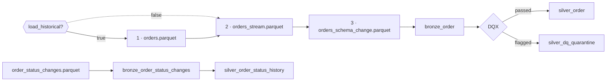
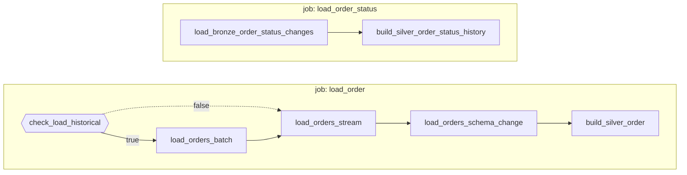

# Flow 05 — Orders

Three Parquet deliveries into one Bronze table, resolved to one row per order through a DQX gate, plus order status history as SCD Type 2.

Requirements: [flows/flows/05_orders.md](../../flows/flows/05_orders.md), plus the general rules in [docs/EXERCISE.md](../../docs/EXERCISE.md), [docs/DATA_MODEL.md](../../docs/DATA_MODEL.md) and [docs/INGESTION_PLAN.md](../../docs/INGESTION_PLAN.md).

## What gets built

| Layer | Object | Source | Write mode | Notebook |
|---|---|---|---|---|
| Bronze | `bronze_order` | `orders.parquet` | append | `01_load_bronze_order.py` |
| Bronze | `bronze_order` | `orders_stream*.parquet` | append, Auto Loader | `02_load_bronze_order_stream.py` |
| Bronze | `bronze_order` | `orders_schema_change.parquet` | append + `mergeSchema` | `03_load_bronze_order_schema_change.py` |
| Silver | `silver_order` | `bronze_order` | merge on `order_id` | `04_build_silver_order.py` |
| Silver | `silver_dq_quarantine` | flagged rows | append | `04_build_silver_order.py` |
| Bronze | `bronze_order_status_changes` | `order_status_changes*.parquet` | append, Auto Loader | `05_load_bronze_order_status_changes.py` |
| Silver | `silver_order_status_history` | `bronze_order_status_changes` | `AUTO CDC`, SCD 2 | `06_silver_order_status_history.py` |

Bronze in schema `bronze_raw`, Silver in `silver`, catalog per bundle target. Dev mode prefixes schemas with `dev_<user>_`.

`silver_dq_quarantine` is shared across sources and not owned by flow 05 — don't drop it when rebuilding.



## The three deliveries

| File | Rows | Orders | `sales_channel` |
|---|---|---|---|
| `orders.parquet` | 30 | `O-0001`–`O-0030` | no |
| `orders_stream.parquet` | 8 | `O-0023`–`O-0030` | no |
| `orders_schema_change.parquet` | 8 | `O-0001`–`O-0008` | yes — 3 `web`, 5 `mobile` |

So `bronze_order` holds 46 rows for 30 orders: the second and third files replay rows the first already delivered, and only `sales_channel` is new. Silver resolves that.

## Jobs

Defined in [resources/flow05.yml](../../resources/flow05.yml). Notebook tasks on serverless environment 6, plus one pipeline for `AUTO CDC`, which is pipeline-only. No triggers — these are fixed files, not a folder receiving deliveries.



Two jobs because the halves share no data, so either can be rebuilt without the other.

### `load_historical`

`orders.parquet` is a backfill, so step 1 sits behind an if/else gate. Default `"false"`: steps 2, 3 and 5 run, step 1 is excluded. Pass `"true"` and all four run, in order.

`load_orders_stream` depends on **two** things, and exactly one is live either way — `load_orders_batch` when the gate is `true`, the `outcome: "false"` edge when it is not. Both are needed because a task whose dependencies are *all* excluded is excluded itself, whatever its `run_if`; with one live dependency, `run_if: ALL_DONE` takes effect. The `outcome` is mandatory — the Jobs API rejects a dependency on an if/else condition without one.

The gate is about intent, not duplicates: step 1 would exit on its own guard anyway if `orders.parquet` were already loaded.

## Bronze

Each notebook reads one delivery via `pathGlobFilter`, because the orders folder also holds the status feed, whose columns are unrelated. No schemas are given — Parquet declares its own types; casting happens in Silver.

**Step 1** — batch read, no checkpoint needed for a single known file.

**Step 2** — Auto Loader, with its own schema location and checkpoint (`_schemas/` and `_checkpoints/bronze_order_stream`, outside `data/` so writing them is not mistaken for an arrival). `schemaEvolutionMode` is stated as `addNewColumns` rather than left to the default, which is conditional. `_rescued_data` is dropped: keeping it would make the stream the only writer bringing a column `bronze_order` lacks, and this workspace refuses automatic schema migration.

**Step 3** — batch read, append with `mergeSchema`, which is the schema evolution the step exists for. Runs last so the widening is a recorded event: the table exists without `sales_channel` before this adds it.

### Idempotency

Append alone would re-add 38 rows per run, so steps 1 and 3 check whether their file name is already among the table's `source_file` values and exit without writing if it is. Step 2 needs no guard — Auto Loader's checkpoint does it. So `bronze_order` stays at 46 rows however often the job runs.

That does **not** make Bronze one row per order. The guards stop a re-run duplicating a delivery; they cannot stop the deliveries overlapping each other. Step 5's dedupe does that.

### The two `mergeSchema` options

Different options, opposite failure modes:

- **Read side**, `spark.read.option("mergeSchema", "true")` — reading many Parquet files in one call does not union their schemas. Spark takes one file's footer, so a column only some files carry can vanish with no error. Each notebook sidesteps this by reading a single file.
- **Write side**, `.option("mergeSchema", "true")` on the append — Delta writes `NULL` for a column the table has and the DataFrame lacks, but *rejects* the reverse. So step 3 cannot land without it, and it fails loudly. It is a writer option, not a Spark conf, so the serverless conf allowlist does not apply.

## Silver

`silver_order` answers "what is this order now"; `silver_order_status_history` answers "what happened to it". Kept separate — `status` here is the one `bronze_order` carries.

**Dedupe:** one row per `order_id`, ordered by `ingested_at` then `order_date` descending, so the most recently ingested row wins.

**Cast and rename** to `FACT_ORDER`, which renames two columns:

| `bronze_order` | `silver_order` | |
|---|---|---|
| `order_id` | `order_id` | `STRING NOT NULL`, merge key |
| `customer_id` | `customer_id` | `BIGINT` → `INT` |
| `product_id` | `product_id` | |
| `currency` | **`currency_code`** | renamed |
| `order_date` | `order_date` | `STRING` → `DATE` |
| `quantity` | `quantity` | `BIGINT` → `INT` |
| `unit_price` | `unit_price` | → `DECIMAL(18,2)` |
| `order_amount` | **`net_amount`** | renamed, → `DECIMAL(18,2)` |
| `status` | `status` | `lower(trim(...))` |
| `sales_channel` | `sales_channel` | nullable, not a `FACT_ORDER` column |

**Write mode:** `MERGE` on `order_id` through the Delta Python API, because the source is the DataFrame DQX returns and a temp view is ruled out by `EXERCISE.md`. `MERGE` needs one row per key, which the dedupe guarantees.

## Data quality

Rules live in [checks/silver_order.yml](../../checks/silver_order.yml), shipped by the bundle and passed to the notebook as the `checks_path` parameter.

| Rule | Function | Category | Criticality |
|---|---|---|---|
| `order_id_is_null` | `is_not_null` | completeness | error |
| `order_id_is_not_unique` | `is_unique` | uniqueness | error |
| `quantity_is_not_positive` | `sql_expression` | validity | error |
| `net_amount_is_negative` | `sql_expression` | validity | error |
| `status_is_not_in_the_list` | `is_in_list` | validity | warn |
| `customer_id_not_in_silver_customer` | `foreign_key` | referential integrity | warn |
| `product_id_not_in_bronze_product` | `foreign_key` | referential integrity | warn |
| `currency_code_not_in_bronze_currency` | `foreign_key` | referential integrity | warn |

`error` rows go to the quarantine and not to Silver; `warn` rows go to both. DQX's passing DataFrame carries no result columns, so `silver_order` keeps its declared shape.

Foreign keys are warnings: a reference that has not loaded yet is not a reason to lose a sale. They point at Silver and Bronze tables, never Gold — Gold is built *from* Silver, so a check at this boundary cannot depend on it. `build_silver_order` therefore needs `silver_customer`, `bronze_product` and `bronze_currency` to exist.

`order_id_is_not_unique` cannot fire as things stand: the dedupe runs before DQX sees the data. It documents the invariant.

**`silver_dq_quarantine`** — one table for every source, told apart by `source_table`:

| Column | Type |
|---|---|
| `source_table` | `STRING NOT NULL` |
| `severity` | `STRING` — `error` or `warn` |
| `row_data` | `VARIANT` — the failing row, whole |
| `failed_checks` | `ARRAY<STRUCT<name, message>>` |
| `quarantined_at` | `TIMESTAMP` |

`VARIANT` because sources have different columns and one shared table cannot give each a typed schema. `failed_checks` holds only name and message — DQX's own result struct has ten fields, most of them bookkeeping, and pinning it in DDL would couple the table to the library version.

## Order status history

`order_status_changes.parquet` is a real change feed: 27 rows for 12 orders (`O-0001`–`O-0012`), each with a `sequence_num`.

`05_...` lands it with Auto Loader, with `schemaEvolutionMode: rescue` so the recorded schema stays fixed and drift goes to `_rescued_data` — the table must stay append-only, because the pipeline reads it as a stream.

`06_...` is a pipeline source, not a notebook. `KEYS (order_id)`, `SEQUENCE BY sequence_num`, `STORED AS SCD TYPE 2`, `APPLY AS DELETE WHEN status = 'cancelled'`. `sequence_num` rather than `changed_at`, because the integer orders the changes exactly where several sharing a date would not. A delete closes the open interval rather than removing rows, so a cancelled order keeps its history and ends with no current row — `__END_AT IS NULL` is the current status. `except_column_list` drops the Bronze tracking columns, which would otherwise sit beside `__START_AT`/`__END_AT` and invite reading one as the other.

The feed contains `delivered`, which appears nowhere in `orders.parquet`, so `silver_order.status` and the history can legitimately disagree.

## Verify

```sql
-- Bronze, per delivery: 30/30/0, 8/8/0, 8/8/8
SELECT source_file, count(*) AS row_count, count(DISTINCT order_id) AS order_count,
       count(sales_channel) AS sales_channel_set
FROM <catalog>.<bronze_schema>.bronze_order GROUP BY source_file ORDER BY source_file;

-- Silver: 30 rows, 30 orders, sales_channel on 8
SELECT count(*), count(DISTINCT order_id), count(sales_channel)
FROM <catalog>.<silver_schema>.silver_order;

-- Quality results
SELECT source_table, severity, count(*) FROM <catalog>.<silver_schema>.silver_dq_quarantine
GROUP BY source_table, severity;
```

Schema evolution is recorded on step 3's write: `DESCRIBE HISTORY` shows `CREATE TABLE AS SELECT` (30), `STREAMING UPDATE` (8), then `WRITE` with `canMergeSchema: true` (8). There is no separate `ADD COLUMNS` entry — `mergeSchema` evolves the schema as part of the append.

All 30 orders pass every rule, so the quarantine is empty on clean data. To produce one example, insert a failing row and re-run `build_silver_order`:

```sql
INSERT INTO <catalog>.<bronze_schema>.bronze_order
    (order_id, customer_id, product_id, order_date, quantity, unit_price,
     currency, order_amount, status, sales_channel, source_file, ingested_at)
VALUES ('O-9001', 999, 'P-999', '2026-01-15', 0, 10.0, 'XXX', -5.0, 'unknown',
        NULL, 'dq_test.parquet', current_timestamp());
```

It trips six of the eight rules, lands with `severity = 'error'`, and `silver_order` stays at 30.

## Design decisions

| Topic | Decision | Reason |
|---|---|---|
| Steps 1–3 as notebooks, not a pipeline | notebook tasks | **Flow ordering.** An earlier version fanned three `append_flow`s into one streaming table; ordering them needs `append_flow`'s `depends_on`, which is Public Preview and cannot be enabled for serverless on Databricks Free Edition. Unordered, whichever delivery commits first decides whether `bronze_order` ever lacked `sales_channel`, so the widening might never be recorded. The pipeline would have been better in one respect: full refresh rebuilds in one command. |
| Order of the three loads | chained with `depends_on` | Makes the widening a recorded schema change. The flow asks for no order and the data is identical either way. |
| Historical load | `load_historical` parameter + `condition_task` | `orders.parquet` is a one-off backfill, so a routine run should not touch it. |
| Idempotency guard on steps 1 and 3 | skip a file already in `source_file` | Unguarded, every re-run added 38 duplicate rows with no way to avoid it. |
| "Latest" for the dedupe | `ingested_at`, then `order_date` | The flow says "keep the latest record per key" without defining latest. |
| Decimal precision | `DECIMAL(18,2)` | `DATA_MODEL.md` says `decimal` without one. Values are whole or 2dp, and `net_amount` is summed downstream after a conversion where float would drift. |
| Row validation in the notebook | only `order_id NOT NULL` in DDL | The flow says "validate keys and amounts" without saying what happens on failure; DQX owns that at this boundary. |
| `sales_channel` in `silver_order` | carried through, nullable | Not a `FACT_ORDER` column, but a late-delivered column must land nullable rather than be dropped. |
| Bronze landing for the status feed | separate `bronze_order_status_changes` | The pipeline could read the Parquet directly, but every Bronze row needs `source_file` and `ingested_at`. |
| Foreign key criticality | `warn` | A missing reference must not drop an order. |
| Quarantine location | `silver.silver_dq_quarantine` | Output of this boundary, and fits the `silver_<entity>` naming. |
| DQX version | pinned in one bundle variable | `silver_job_dependencies` in `databricks.yml`. DQX documents breaking changes between releases. |

## Deploy and run

The four Parquet files go in `/Volumes/<catalog>/<bronze_schema>/input_data/data/orders/`.

```bash
databricks bundle deploy -t dev

databricks bundle run load_order -t dev --params load_historical=true   # first run
databricks bundle run load_order -t dev                                 # routine runs
databricks bundle run load_order_status -t dev
```

Both jobs are safe to re-run and commit nothing when there is nothing new. `silver_customer`, `bronze_product` and `bronze_currency` must exist before `load_order`, for the foreign key checks.

To start `bronze_order` from scratch, which is what makes the schema evolution reproducible:

```sql
DROP TABLE IF EXISTS <catalog>.<bronze_schema>.bronze_order;
```

```python
root = "/Volumes/<catalog>/<bronze_schema>/input_data"
dbutils.fs.rm(f"{root}/_checkpoints/bronze_order_stream", True)
dbutils.fs.rm(f"{root}/_schemas/bronze_order_stream", True)
```

Then re-run with `load_historical=true`, or the 30-order snapshot will not come back.
