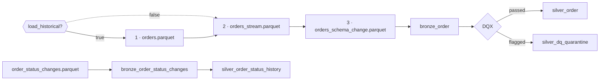
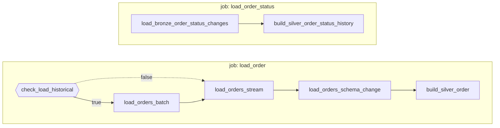

# Flow 05 — Orders

Lands three Parquet deliveries into one Bronze table, resolves them to one row per order through a DQX quality gate, and builds the order status history as SCD Type 2.

Requirements: [flows/flows/05_orders.md](../../flows/flows/05_orders.md), plus the general rules in [docs/EXERCISE.md](../../docs/EXERCISE.md), [docs/DATA_MODEL.md](../../docs/DATA_MODEL.md) and [docs/INGESTION_PLAN.md](../../docs/INGESTION_PLAN.md). The quality gate follows [flows/flows/06_data_quality_cleaning_joining.md](../../flows/flows/06_data_quality_cleaning_joining.md) section 2.

## What gets built

| Layer | Object | Type | Source | Write mode | Notebook |
|---|---|---|---|---|---|
| Bronze | `bronze_order` | table | `data/orders/orders.parquet` | append | `01_load_bronze_order.py` |
| Bronze | `bronze_order` | table | `data/orders/orders_stream*.parquet` | append, Auto Loader | `02_load_bronze_order_stream.py` |
| Bronze | `bronze_order` | table | `data/orders/orders_schema_change.parquet` | append + `mergeSchema` | `03_load_bronze_order_schema_change.py` |
| Silver | `silver_order` | table | `bronze_order` | merge/upsert on `order_id` | `04_build_silver_order.py` |
| Silver | `silver_dq_quarantine` | table | flagged rows | append | `04_build_silver_order.py` |
| Bronze | `bronze_order_status_changes` | table | `data/orders/order_status_changes*.parquet` | append, Auto Loader | `05_load_bronze_order_status_changes.py` |
| Silver | `silver_order_status_history` | table, SCD Type 2 | `bronze_order_status_changes` | `AUTO CDC` | `06_silver_order_status_history.py` |

Bronze objects live in schema `bronze_raw` and Silver in `silver`, in the catalog chosen by the bundle target (`poc_dev`, `poc_test`, `poc`). In the `dev` target, development mode prefixes schema names with `dev_<user>_`.

`silver_dq_quarantine` is shared with every other flow's Bronze to Silver gate, not owned by flow 05. See [Data quality](#data-quality).



The three deliveries are numbered because they run **in sequence**, one task each, all appending to the same table — not three writers in parallel. That order is what makes the schema widening at step 3 a recorded event.

The if/else at the front is the `load_historical` gate: on `true` the historical load runs and the chain starts at step 1, on `false` it is skipped and the chain starts at step 2. How each delivery is read is in [Approach — Bronze](#approach--bronze).

## The three deliveries

All three files are Parquet and all three feed the same table. That is the point of the flow: same format does not mean new data.

| File | Rows | Orders | Carries `sales_channel` |
|---|---|---|---|
| `orders.parquet` | 30 | `O-0001` to `O-0030` | no |
| `orders_stream.parquet` | 8 | `O-0023` to `O-0030` | no |
| `orders_schema_change.parquet` | 8 | `O-0001` to `O-0008` | yes — 3 `web`, 5 `mobile` |

So `bronze_order` holds 46 rows for 30 orders. Every row in the second and third files is a replay of a row the first file already delivered; only `sales_channel` is new. Resolving that is Silver's job, not Bronze's.

## Job and trigger

Defined in [resources/flow05.yml](../../resources/flow05.yml). Two jobs, with notebook tasks on serverless environment version 6 plus one pipeline for the feature that is pipeline-only.



The dotted edge is the one that keeps the chain alive when step 1 is excluded — see [The `load_historical` parameter](#the-load_historical-parameter). The two jobs are independent; nothing crosses between them.

`load_order` — steps 1 to 3 and 5:

| Task | Type | Depends on | `run_if` |
|---|---|---|---|
| `check_load_historical` | If/else condition | — | — |
| `load_orders_batch` | Notebook | `check_load_historical`, outcome `true` | `ALL_SUCCESS` |
| `load_orders_stream` | Notebook, Auto Loader | `check_load_historical` outcome `false`, `load_orders_batch` | `ALL_DONE` |
| `load_orders_schema_change` | Notebook | `load_orders_stream` | `ALL_SUCCESS` |
| `build_silver_order` | Notebook | `load_orders_schema_change` | `ALL_SUCCESS` |

### The `load_historical` parameter

`orders.parquet` is a backfill — "the initial historical load", in the flow's own words — not something a routine run should repeat. So step 1 sits behind a gate:

| `load_historical` | What runs |
|---|---|
| `"false"` (default) | steps 2, 3 and 5. Step 1 is excluded. |
| `"true"` | all four notebook tasks, in order. |

A job cannot branch on a parameter without an if/else `condition_task`, which is what `check_load_historical` is. It needs no compute.

The shape of the rest of the graph is dictated by one rule in the [`run_if` documentation](https://docs.databricks.com/aws/en/jobs/run-if):

> If all of a task's dependencies are excluded, the task itself is also excluded, regardless of its `Run if` condition.

`load_orders_stream` is where the two branches rejoin, and its pair of dependencies is the crux of the whole graph. Exactly one of them is live in either case:

| `load_historical` | `check_load_historical` outcome `false` | `load_orders_batch` | Step 2 |
|---|---|---|---|
| `"true"` | excluded — wanted `false`, got `true` | **runs** | runs, after step 1 |
| `"false"` | **live** — wanted `false`, got `false` | excluded | runs |

Both edges are needed, because a task whose dependencies are *all* excluded is excluded itself regardless of `run_if`. Depending on step 1 alone would exclude step 2 on every routine run and cascade down the chain until the job did nothing but evaluate the condition.

The `outcome` on the condition edge is not optional. The Jobs API rejects a dependency on an if/else condition that omits it:

> The dependency on an if/else condition "check_load_historical" does not specify an outcome. Please add "outcome": "true" or "outcome": "false" to the dependency. (400 INVALID_PARAMETER_VALUE)

It reads oddly next to the task it gates, but `"false"` here means "the historical load was not asked for", which is exactly when that edge has to carry the chain.

With one live dependency either way, `run_if: ALL_DONE` takes effect and step 2 runs regardless. Steps 3 and 5 then need no `run_if` at all: each depends on a task that always runs, and the ordering batch → stream → schema change holds, so the table always exists without `sales_channel` before step 3 widens it.

The one trade-off is that `ALL_DONE` cannot distinguish "excluded" from "failed", so step 2 runs even if step 1 failed. Bronze writes are atomic, so that means working from an older Bronze rather than a corrupt one, and the job run is still reported as failed.

Note what the gate is and is not for. Step 1 would exit on its own `source_file` guard anyway if `orders.parquet` were already loaded, so the parameter is about intent and about not starting the task at all — not about preventing duplicates.

`load_order_status` — step 6:

| Task | Type | Depends on |
|---|---|---|
| `load_bronze_order_status_changes` | Notebook, Auto Loader | — |
| `build_silver_order_status_history` | Pipeline, `AUTO CDC` | `load_bronze_order_status_changes` |

Two jobs rather than one, which is also how flows 01 and 02 are arranged. The halves share no data: the status feed is a different file with different columns, and `silver_order_status_history` is built from it alone. Separating them means either half can be rebuilt without the other.

**Trigger: none** on either job. Flow 05 specifies none, and unlike flows 03 and 04 these are four fixed files rather than a folder that keeps receiving deliveries.

## Approach — Bronze

### Step 1, `orders.parquet`

- A batch read, not Auto Loader. One known file delivered once, so there is no arrival of new files to track and nothing for a checkpoint to remember.
- `pathGlobFilter` restricts the read to this one file. The orders folder also holds the other two deliveries and the status change feed, whose columns are entirely different.
- No schema is given. Parquet declares its own types, so they are read rather than guessed. Casting happens in Silver.
- No `mergeSchema`. This file never adds a column, and Delta writes `NULL` for a column the table has that the DataFrame does not — so this append keeps working after step 3 has widened the table.

### Step 2, `orders_stream.parquet`

- Auto Loader, with its own schema location and checkpoint, as the flow asks for by name:
  `_schemas/bronze_order_stream` and `_checkpoints/bronze_order_stream`. Both sit outside `data/`, so writing them never looks like a file arriving.
- `cloudFiles.schemaEvolutionMode` is stated as `addNewColumns` rather than left to the default, because the default is conditional: it applies only while no schema is given, and adding one would silently turn it to `none`.
- `_rescued_data` is dropped. Auto Loader adds it whenever it infers a schema, and keeping it would make this the only writer bringing a column `bronze_order` does not have — which this workspace refuses, since automatic schema migration is not permitted on a table with ACLs enabled. The cost is that a stream delivery whose values stop fitting their type loses them here; that check belongs to flow 06.
- The checkpoint makes this step idempotent. It does not make the table one row per order — see below.

### Step 3, `orders_schema_change.parquet`

- A batch read of its own file, so its footer is the schema and `sales_channel` is certain to be present.
- Append with `mergeSchema` on the write, which is the schema evolution the step exists to show.
- Runs after steps 1 and 2 so the widening is a recorded event. `bronze_order` is created without `sales_channel` and gains it here. Run this first instead and the table has the column from the outset, no widening is ever recorded, and the demonstration is gone. The data is identical either way.

## The two `mergeSchema` options

Flow 05's "risk" section warns about both, and they are different options with opposite failure modes. Neither notebook needs the read-side one, because each reads a single file — but the risk is real and worth seeing.

**Read side** — `spark.read.option("mergeSchema", "true")`. Reading many Parquet files in one call does not union their schemas. Spark takes the schema from one file's footer, so a column only some files carry can be absent with no error raised. This is the silent one:

```python
source_dir = "/Volumes/<catalog>/<bronze_schema>/input_data/data/orders"

# orders*.parquet matches the three order deliveries and not
# order_status_changes.parquet, whose columns are entirely different.
no_merge = spark.read.format("parquet").option("pathGlobFilter", "orders*.parquet").load(source_dir)
merged = (
    spark.read.format("parquet")
    .option("pathGlobFilter", "orders*.parquet")
    .option("mergeSchema", "true")
    .load(source_dir)
)

print(len(no_merge.columns), "sales_channel" in no_merge.columns)
print(len(merged.columns), "sales_channel" in merged.columns)
```

Which schema the first read returns is decided by whichever footer Spark picks, so it is not guaranteed to drop `sales_channel` on any given run. That it is not guaranteed to keep it is the entire problem. Only the merged read promises the union.

**Write side** — `.option("mergeSchema", "true")` on the Delta append. Delta's append validation is asymmetric: a column the table has that the DataFrame does not is written as `NULL`, while a column the DataFrame has that the table does not is rejected. So step 3 cannot land without it, and it fails loudly rather than silently.

## Append alone is not idempotent

The write mode is append, as the flow asks. Append on its own would mean every re-run of the job put the same rows into `bronze_order` again — 30 from step 1 and 8 from step 3, 38 each time, for ever.

So each of the two batch steps is guarded the way [flow 03's customer load](../flow03/01_load_bronze_customer.py) is guarded: before reading, it checks whether its file name is already among the table's `source_file` values, and exits without writing if it is. `source_file` makes the table its own record of which deliveries have landed, so the check needs no checkpoint — the target table is the state. On the first run the table does not exist and nothing is skipped.

Step 2 needs no guard — Auto Loader's checkpoint already records the file as read.

| | `bronze_order` rows | distinct `order_id` |
|---|---|---|
| after run 1 | 46 | 30 |
| after any re-run | 46 | 30 |

A re-run of `load_order` therefore commits nothing to Bronze and simply rebuilds Silver from it.

**This does not make Bronze one row per order.** The 46 rows are 30 orders, because the three deliveries genuinely repeat rows: `orders_stream.parquet` replays the last 8 and `orders_schema_change.parquet` replays the first 8. The guard stops a *re-run* duplicating a delivery; it cannot stop the deliveries overlapping each other. Resolving that is step 5's dedupe, which is why `silver_order` is 30 rows.

To demonstrate that append alone is not idempotent — flow 05 step 4's point — the guard has to be bypassed deliberately, by deleting a delivery's rows from `bronze_order` and re-running:

```sql
DELETE FROM <catalog>.<bronze_schema>.bronze_order WHERE source_file = 'orders.parquet';
```

Before the guard existed, a second run was observed to add exactly 38 rows: a `WRITE` of 30 and a `WRITE` of 8 in `DESCRIBE HISTORY`, and **no** `STREAMING UPDATE` at all, confirming that Auto Loader's checkpoint held while the two batch steps re-appended. That second `WRITE` of 30 also carried no `mergeSchema` and still succeeded against a table that by then had `sales_channel`, which is Delta writing `NULL` for a column the DataFrame does not carry.

## Approach — Silver

`silver_order` answers "what is this order now". `silver_order_status_history` answers "what happened to it over time". They are kept separate, and `status` in `silver_order` is the one `bronze_order` carries — the change feed is not read by `04_build_silver_order.py`.

### Dedupe

One row per `order_id`, ordered by `ingested_at` then `order_date`, descending. Both descending means the most recently ingested row for an order wins, so whichever of the three deliveries landed last decides. `order_date` never actually breaks a tie in this data, because the replays are identical to their originals apart from `sales_channel`.

One consequence: the 8 orders that `orders_schema_change.parquet` replays keep their `sales_channel` only while that delivery is the most recent to have carried them. Re-run step 1 on its own and those rows become the newest, and `sales_channel` goes back to `NULL` for `O-0001` to `O-0008`.

### Cast and rename

The target is `FACT_ORDER` from [docs/DATA_MODEL.md](../../docs/DATA_MODEL.md), which renames two columns:

| `bronze_order` | `silver_order` | Change |
|---|---|---|
| `order_id` | `order_id` | `STRING NOT NULL`, the merge key |
| `customer_id` | `customer_id` | `BIGINT` to `INT` |
| `product_id` | `product_id` | — |
| `currency` | **`currency_code`** | renamed |
| `order_date` | `order_date` | `STRING` to `DATE` |
| `quantity` | `quantity` | `BIGINT` to `INT` |
| `unit_price` | `unit_price` | `DOUBLE` to `DECIMAL(18,2)` |
| `order_amount` | **`net_amount`** | renamed, `DOUBLE` to `DECIMAL(18,2)` |
| `status` | `status` | `lower(trim(...))` |
| `sales_channel` | `sales_channel` | nullable, not a `FACT_ORDER` column |

`sales_channel` is carried through because flow 06 section 1 requires a column delivered later to land as nullable in Silver with older rows `NULL`, naming `sales_channel` and flow 05 explicitly.

The schema is declared with `CREATE TABLE IF NOT EXISTS`, so the shape is pinned for Gold and the dashboard rather than derived from the query.

### Write mode

`MERGE` on `order_id`, through the Delta Python API rather than SQL. The merge source is the DataFrame DQX returns, and a temp view to make it addressable from SQL is what [docs/EXERCISE.md](../../docs/EXERCISE.md) rules out. `MERGE` needs one row per key in its source, which the dedupe guarantees — without it the statement fails rather than picking a row.

## Data quality

The gate runs at the Bronze to Silver boundary, as flow 06 section 2 asks. Rules live in [checks/silver_order.yml](../../checks/silver_order.yml), not in the notebook, and the bundle ships the file to the workspace — `04_build_silver_order.py` receives its path as the `checks_path` job parameter, resolved from `${workspace.file_path}`.

| Rule | Function | Category | Criticality |
|---|---|---|---|
| `order_id_is_null` | `is_not_null` | completeness | error |
| `order_id_is_not_unique` | `is_unique` | uniqueness | error |
| `quantity_is_not_positive` | `sql_expression` | validity | error |
| `net_amount_is_negative` | `sql_expression` | validity | error |
| `status_is_not_in_the_list` | `is_in_list` | validity | warn |
| `customer_id_not_in_silver_customer` | `foreign_key` | referential integrity | warn |
| `product_id_not_in_bronze_product` | `foreign_key` | referential integrity | warn |
| `currency_code_not_in_bronze_currency` | `foreign_key` | referential integrity | warn |

`error` rows go to `silver_dq_quarantine` and not to `silver_order`. `warn` rows go to both: usable, but recorded. DQX's own split does this — the passing DataFrame carries no result columns, which is why `silver_order` keeps exactly its declared shape with nothing to drop.

Every foreign key is a warning rather than an error, following flow 06 section 3's instruction to "use left joins wherever a missing invoice/rate must not drop the order": a reference that has not loaded yet is not a reason to lose a sale.

The references are Silver and Bronze tables, never Gold dimensions. Gold is built from Silver, so a check at the Bronze to Silver boundary cannot depend on it. `bronze_product` is used because flow 02 publishes as-is and has no Silver table. This does couple `build_silver_order` to flows 01, 02 and 03 having run at least once — a missing reference table fails the task as a missing table, not as a quality warning.

`order_id_is_not_unique` cannot fire as things stand: the dedupe runs before DQX sees the data, so `order_id` is unique by construction. It documents the invariant and would catch a dedupe regression.

### The shared quarantine table

One table for every source, as flow 06 requires — not one per table. Sources are told apart by `source_table`.

| Column | Type | |
|---|---|---|
| `source_table` | `STRING NOT NULL` | which Bronze table the row came from |
| `severity` | `STRING` | `error` or `warn` |
| `row_data` | `VARIANT` | the failing row, whole |
| `failed_checks` | `ARRAY<STRUCT<name, message>>` | which rules and why |
| `quarantined_at` | `TIMESTAMP` | |

`row_data` is `VARIANT` because the sources have different columns and one shared table cannot give each a typed schema. The same approach is already used for `bronze_invoice.parsed_data`.

`failed_checks` holds only the rule name and message. DQX's own result struct has ten fields, most of them its bookkeeping, and pinning that shape in DDL would recouple the table to the library version.

## Checks and evidence

All of these are queries to run, not tasks in the job.

**Bronze: what landed, per delivery**

```sql
SELECT source_file, count(*) AS row_count, count(DISTINCT order_id) AS order_count,
       count(sales_channel) AS sales_channel_set
FROM <catalog>.<bronze_schema>.bronze_order
GROUP BY source_file ORDER BY source_file;
```

| `source_file` | `row_count` | `order_count` | `sales_channel_set` |
|---|---|---|---|
| `orders.parquet` | 30 | 30 | 0 |
| `orders_schema_change.parquet` | 8 | 8 | 8 |
| `orders_stream.parquet` | 8 | 8 | 0 |

**Schema evolution result** — the widening is recorded on step 3's write:

```sql
DESCRIBE HISTORY <catalog>.<bronze_schema>.bronze_order;
```

Read the first three versions of a clean load:

| Version | Operation | Rows | Task |
|---|---|---|---|
| 0 | `CREATE TABLE AS SELECT` | 30 | step 1 — `saveAsTable` creates the table on its first run |
| 1 | `STREAMING UPDATE` | 8 | step 2, Auto Loader |
| 2 | `WRITE` with `canMergeSchema: true` | 8 | step 3 — this is the widening |

There is no separate `ADD COLUMNS` entry. `mergeSchema` evolves the schema as part of the append, so the evidence is the `canMergeSchema` flag in `operationParameters` on step 3's write, and the fact that versions 0 and 1 came before it.

**Silver: the replays are resolved**

```sql
SELECT count(*) AS row_count, count(DISTINCT order_id) AS order_count,
       count(sales_channel) AS sales_channel_set
FROM <catalog>.<silver_schema>.silver_order;
```

30 rows, 30 orders, `sales_channel` set on 8.

**Quality results**

```sql
SELECT source_table, severity, count(*) AS rows_flagged
FROM <catalog>.<silver_schema>.silver_dq_quarantine
GROUP BY source_table, severity;
```

Every one of the 30 orders passes all eight rules, so this is empty on clean data. To produce one quarantine example, insert a row that fails and re-run `build_silver_order`:

```sql
INSERT INTO <catalog>.<bronze_schema>.bronze_order
    (order_id, customer_id, product_id, order_date, quantity, unit_price,
     currency, order_amount, status, sales_channel, source_file, ingested_at)
VALUES
    ('O-9001', 999, 'P-999', '2026-01-15', 0, 10.0, 'XXX', -5.0, 'unknown',
     NULL, 'dq_test.parquet', current_timestamp());
```

It trips six of the eight rules — both `sql_expression` errors, the status list, and all three foreign keys — so it lands with `severity = 'error'` and six entries in `failed_checks`, and `silver_order` stays at 30 because an error row never reaches it. Afterwards, remove the source row with
`DELETE FROM ... WHERE source_file = 'dq_test.parquet'`. The quarantine row survives, which is the point.

**Status history against current status** — the optional join from flow 05 step 6:

```sql
SELECT o.order_id, o.status AS current_status, h.status AS history_status,
       h.__START_AT, h.__END_AT
FROM <catalog>.<silver_schema>.silver_order AS o
LEFT JOIN <catalog>.<silver_schema>.silver_order_status_history AS h
  ON o.order_id = h.order_id
ORDER BY o.order_id, h.__START_AT;
```

## Approach — order status history

`order_status_changes.parquet` is a real change feed, not a replay: 27 rows for 12 orders (`O-0001` to `O-0012`), each with a `sequence_num`.

### Bronze landing

`05_load_bronze_order_status_changes.py` lands it with Auto Loader, with its own schema location and checkpoint. `schemaEvolutionMode` is `rescue` here rather than `addNewColumns`: the recorded schema stays fixed and anything not fitting it is kept in `_rescued_data` instead of widening the table, so drift is a query — `WHERE _rescued_data IS NOT NULL`. Holding the schema fixed matters because the pipeline downstream reads this table as a stream.

The table has to stay append-only for the same reason: a stream cannot read a source whose rows are updated or deleted.

### SCD Type 2

`06_silver_order_status_history.py` is a Lakeflow pipeline source, not a notebook, because `AUTO CDC` is pipeline-only. It is listed under `libraries` in the `order_status_history` pipeline.

- `KEYS (order_id)`, `SEQUENCE BY sequence_num`, `STORED AS SCD TYPE 2`.
- `sequence_num`, not `changed_at`: the feed numbers the changes per order, so the integer orders them exactly where several changes sharing a date would not.
- `APPLY AS DELETE WHEN status = 'cancelled'`. In SCD Type 2 a delete closes the open interval rather than removing rows, so a cancelled order keeps its history and ends with no current row.
- `except_column_list` drops `source_file`, `ingested_at` and `_rescued_data`. `ingested_at` records when a row was loaded, where `__START_AT` and `__END_AT` record when a status was in force; keeping both invites reading one as the other.

`__END_AT IS NULL` is the current status. The feed holds 4 cancelled events, so 4 of the 12 orders end with no current row.

The feed also contains `delivered`, a status that appears nowhere in `orders.parquet`. So `silver_order.status` and the history can legitimately disagree, which is what the join above is for.

## Design decisions not specified in the requirements

| Topic | Decision | Reason |
|---|---|---|
| Steps 1 to 3 as notebooks | Notebook tasks, not a pipeline | The flow's own job summary specifies Notebook/SQL for these steps and reserves the pipeline for step 6. An earlier version used a second pipeline with three append flows into one streaming table. Two things decided against it: a pipeline cannot order its flows here (see the row below), and a one-off delivery in a pipeline is `append_flow(once=True)`, which runs on the first update and on a full refresh with no say in the matter, where `load_historical` makes it a decision per run. Note that "a pipeline makes every delivery idempotent, which hides step 4's point about append" is *not* among the reasons: the `source_file` guards do the same thing here, by hand rather than by framework. |
| Order of the three loads | Chained with `depends_on`: batch, then stream, then schema change | Makes the widening a recorded schema change in `bronze_order`'s history. In parallel, whichever delivery commits first decides whether the table ever lacked the column. The flow does not ask for an order and the data is identical either way. This ordering is only available because the loads are job tasks. Inside a Lakeflow pipeline, flow ordering is `append_flow`'s `depends_on` parameter, which is [Public Preview](https://docs.databricks.com/aws/en/ldp/developer/ldp-python-ref-append-flow) — and the preview cannot be enabled for serverless compute on Databricks Free Edition, which is what this project runs on. A pipeline would run the three flows with no ordering between them. |
| Two jobs, not one | `load_order` and `load_order_status` | The flow's step 7 shows a single job summary table but does not say one job, and flows 01 and 02 each use two. The halves share no data, so neither needs to wait on the other and either can be rebuilt alone. A single job with an if/else `condition_task` on a parameter was considered and rejected: it makes a full build impossible in one run, and the skipped half reads as a failure in run history. |
| Trigger | None | The flow specifies none, and these are fixed files rather than a folder receiving deliveries. Flows 03 and 04 have file-arrival triggers because an upload is genuinely the event there. |
| Gating the historical load | `load_historical` parameter + an if/else `condition_task`, default `"false"` | `orders.parquet` is a one-off backfill. In the pipeline design this was `append_flow(once=True)`, which runs a flow on the first update only; that route is unavailable here, so the equivalent is an explicit parameter. A routine run then touches only the ongoing deliveries. |
| Idempotency guard on steps 1 and 3 | Skip a file whose name is already in `source_file` | The flow asks for append and then points out that append is not idempotent. Leaving it unguarded meant every re-run added 38 duplicate rows with no way to avoid it. The guard is the one flow 03 already uses, costs one `DISTINCT` against the target, and leaves step 5's dedupe doing what it is there for — resolving the overlap *between* deliveries, which no guard can prevent. |
| `_rescued_data` on the stream | Dropped | Auto Loader adds it when inferring a schema. Keeping it would make the stream the only writer bringing a column the table lacks, and this workspace refuses automatic schema migration. flow 02's product load and the status feed both keep theirs, because both pin a schema and want drift visible. |
| "Latest" for the dedupe | `ingested_at` then `order_date`, descending | The flow says "keep the latest record per key" without defining latest. |
| Decimal precision | `DECIMAL(18,2)` | `DATA_MODEL.md` says `decimal` without a precision. Every source value is whole or two decimal places, and flow 06 sums `net_amount * rate_to_pln`, where float arithmetic would drift. |
| Row validation in the notebook | None beyond `order_id NOT NULL` in the DDL | The flow says "validate keys and amounts" without saying what happens on failure. Flow 06 puts quality at this boundary with DQX and one shared quarantine table, so a `WHERE` clause here is a thing that would have to be removed again. |
| `sales_channel` in `silver_order` | Carried through, nullable | Not a `FACT_ORDER` column, but flow 06 section 1 requires it by name. |
| `MERGE` via the Delta Python API | Not SQL | The source is the DataFrame DQX returns. A temp view to address it from SQL is ruled out by `EXERCISE.md`. |
| Bronze landing for the status feed | A separate `bronze_order_status_changes` table | The pipeline could read the Parquet directly, but `DATA_MODEL.md` rule 3 wants `source_file` and `ingested_at` on every Bronze row, and the table is not in `INGESTION_PLAN.md`'s list. |
| Foreign key references | Silver and Bronze tables, not Gold | Gold is built from Silver, so a check at this boundary cannot depend on it. True even once the Gold dimensions exist. |
| Foreign key criticality | `warn` | Flow 06 section 3 says a missing reference must not drop the order. |
| Quarantine table location | `silver`, named `silver_dq_quarantine` | It is the output of this boundary and fits `EXERCISE.md`'s `silver_<entity>` naming. A dedicated schema would be defensible but adds an object no document mentions. |
| Quarantine `row_data` | `VARIANT` | One shared table cannot give each source a typed schema. Already used for `bronze_invoice.parsed_data`. |
| `failed_checks` shape | Only `name` and `message` | DQX's result struct has ten fields, most of them bookkeeping, and pinning it in DDL would recouple the table to the library version. |
| DQX version | Pinned in one bundle variable | `silver_job_dependencies` in `databricks.yml`, referenced by all four Silver jobs. DQX documents breaking changes between releases, and a pin living in four files goes stale in three. |

## Deploy and run

The four Parquet files go in one folder, which is what every notebook here reads:

```
/Volumes/<catalog>/<bronze_schema>/input_data/data/orders/orders.parquet
/Volumes/<catalog>/<bronze_schema>/input_data/data/orders/orders_stream.parquet
/Volumes/<catalog>/<bronze_schema>/input_data/data/orders/orders_schema_change.parquet
/Volumes/<catalog>/<bronze_schema>/input_data/data/orders/order_status_changes.parquet
```

```bash
databricks bundle deploy -t dev

# First run on a fresh environment: include the historical load.
databricks bundle run load_order -t dev --params load_historical=true

# Routine runs: the ongoing deliveries only.
databricks bundle run load_order -t dev

databricks bundle run load_order_status -t dev   # step 6
```

Without `load_historical=true` the first run loads only the 8 + 8 rows of the stream and schema-change deliveries, and `bronze_order` never receives the 30-order snapshot.

The two jobs are independent and can run in either order, or on their own, and both are safe to re-run. `load_order_status` commits nothing when there is no new file, because of its Auto Loader checkpoint and because an `AUTO CDC` update with no new source rows applies nothing. `load_order` commits nothing to Bronze either — see [Append alone is not idempotent](#append-alone-is-not-idempotent) — and rebuilds Silver from what is there.

Flows 01, 02 and 03 must have run at least once before `load_order`, because the DQX foreign key checks read `silver_customer`, `bronze_product` and `bronze_currency`.

To start `bronze_order` from scratch — which is what makes the schema evolution reproducible:

```sql
DROP TABLE IF EXISTS <catalog>.<bronze_schema>.bronze_order;
```

```python
root = "/Volumes/<catalog>/<bronze_schema>/input_data"
dbutils.fs.rm(f"{root}/_checkpoints/bronze_order_stream", True)
dbutils.fs.rm(f"{root}/_schemas/bronze_order_stream", True)
```
